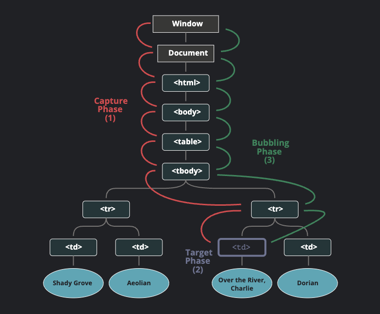
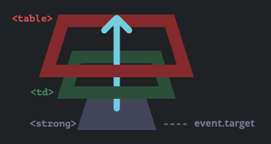

# 이벤트 기초

> (https://ko.javascript.info/events)를 정리한 내용입니다.

- 브라우저 이벤트, 이벤트 프로퍼티에 대해 소개하고 이벤트 핸들링 기초를 다룬다.

## 1. 브라우저 이벤트 소개

- 이벤트는 무언가 일어났다는 신호고, 모든 DOM 노드는 이런 신호를 만들어낸다.
- 이벤트는 DOM에만 한정되진 않는다.

- 마우스 이벤트

  - `click`: 요소를 마우스로 클릭했을 때 발생.
  - `contextmenu`: 요소를 마우스 오른쪽 버튼으로 클릭했을 때 발생.
  - `mouseover`와 `mouseout`: 마우스 커서를 요소 위로 움직였을 때, 커서가 요소 밖으로 움직였을 때 발생.
  - `mousedown`과 `mouseup`: 요소 위에서 마우스 왼쪽 버튼을 누르고 있을 때, 마우스 버튼을 뗄 때 발생.
  - `mousemove`: 마우스를 움직일 때 발생.

- 폼 요소 이벤트

  - `submit`: 사용자가 `form`을 제출할 때 발생
  - `focus`: 사용자가 `input`과 같은 요소에 포커스 할 때 발생.

- 키보드 이벤트

  - `keydown`과 `keyup`: 사용자가 키보드 버튼을 누르거나 뗄 때 발생.

- DOM 이벤트

  - `DOMContentLoaded`: HTML이 전부 로드 및 처리되어 DOM 생성이 완료되었을 때 발생.

- CSS 이벤트

  - `transitionend`: CSS 애니메이션이 종료되었을 때 발생.

- 이 외에도 다양한 이벤트가 있는데, 몇몇 이벤트는 다음 챕터에서 자세히 다룰 예정이다.

### 이벤트 핸들러

- 이벤트에 반응하려면 이벤트가 발생했을 때 실행되는 함수인 핸들러를 할당해야 한다.
- 핸들러는 사용자의 행동에 어떻게 반응할지를 자바 스크립트 코드로 표현한 것이다.
- 핸들러는 여러 가지 방법으로 할당할 수 있다.

#### HTML 속성

```html
<input value="클릭해 주세요." onclick="alert('클릭!')" type="button" />
```

- HTML 안에 `on<event>` 속성에 핸들러를 할당할 수 있다.
- 만약 코드가 길다면 함수를 만들어서 이를 호출하는 방법을 추천한다.
- HTML 속성은 대소문자를 구분하지 않지만 대개 소문자로 작성한다.

### DOM 프로퍼티

```html
<input id="elem" type="button" value="클릭해주세요." />
<script>
  elem.onclick = function () {
    alert("감사합니다.");
  };
</script>
```

- DOM 프로퍼티 `on<event>`을 사용해도 핸들러를 할당할 수 있다.
- HTML 속성은 HTML 속성을 사용해 button.onclick을 초기화하고 DOM 프로퍼티는 스크립트를 사용한다는 점이다.
- `onclick` 프로퍼티는 단 하나밖에 없기 때문에, 복수의 이벤트 핸들러를 할당할 수 없다.

  ```html
  <input
    type="button"
    id="elem"
    onclick="alert('이전')"
    value="클릭해 주세요."
  />
  <script>
    elem.onclick = function () {
      // 기존 작성된 핸들러를 덮어씀
      alert("이후"); // 이 경고창만 보인다.
    };
  </script>
  ```

  - 핸들러를 제거하고 싶다면 `elem.onclick = null`을 할당하면 된다.

### this로 요소에 접근하기

```html
<button onclick="alert(this.innerHTML)">클릭해 주세요.</button>
```

- 핸들러 내부에 쓰면 `this`의 값은 핸들러가 할당된 요소다.
- 따라서 버튼을 클릭하면 "클릭해 주세요."가 출력된다.

### 자주 하는 실수

```js
function sayThanks() {
  alert("감사합니다!");
}

// 올바른 방법
button.onclick = sayThanks;

// 틀린 방법
button.onclick = sayThanks();
```

- 하지만 HTML 속성값에는 괄호가 있어야 한다.

```html
<input type="button" id="button" onclick="sayThanks()" />
```

- 브라우저는 속성값을 읽고, 속성값을 함수 본문으로 하는 핸들러 함수를 만들기 때문에 이런 차이가 발생한다.
- 브라우저는 `onclick` 프로퍼티에 새로운 함수를 할당한다.
  ```js
  button.onclick = function () {
    sayThanks(); // 속성값
  };
  ```
- `setAttribute`로 핸들러를 할당하지 마세요.
  ```js
  document.body.setAttribute("onclick", function () {
    alert(1);
  });
  ```
  - 위 코드는 동작하지 않는다.
- DOM 프로퍼티는 대소문자를 구분한다.

### addEventListener

- HTML 속성과 DOM 프로퍼티를 이용한 이벤트 핸들러 할당 방식엔 하나의 이벤트에 복수의 핸들러를 할당할 수 없는 문제가 있다.
- 버튼을 클릭하면 버튼을 강조하면서 메세지를 보여주고 싶을 때 기존 방법으로는 프로퍼티가 덮어씌워진다는 문제가 있다.
  ```js
  input.onclick = function () {
    alert(1);
  };
  input.onclick = function () {
    alert(2);
  }; // 이전 핸들러를 덮어씀
  ```
- 웹 표준에 관여하는 개발자들은 오래전부터 이 문제를 인지하고 `addEventListener`와 `removeEventListener`라는 특별한 메서드를 이용해 핸들러를 관리하자는 대안을 제시했다.

```js
element.addEventListener(event, handler, [options]);
```

- `event`: 이벤트 이름
- `handler`: 핸들러 함수
- `options`
  - `once`: `true`이면 이벤트가 트리거 될 때 리스너가 자동으로 삭제된다.
  - `capture`: 어느 단계에서 이벤트를 다뤄야 하는지를 알려주는 프로퍼티로, 관련 내용은 버블링과 캡처링 챕터에서 자세히 다룰 예정이다. 호환성 유지를 위해 `options`를 객체가 아닌 `false/true`로 할당하는 것도 가능한데, 이는 `{capture: false, true}`와 동일하다.
  - `passive`: `true`면 리스너에서 지정한 함수가 `preventDefault()`를 호출하지 않는다. 자세한 내용은 브라우저 기본 동작에서 다룬다.
- 핸들러 삭제는 `removeEventListener`로 한다.
- 삭제는 동일한 함수만 할 수 있다.

  ```js
  elem.addEventListener("click", () => alert("감사합니다!"));
  elem.removeEventListener("click", () => alert("감사합니다!"));
  ```

  - 핸들러를 삭제하려면 핸들러 할당 시 사용한 함수를 그대로 전달해주어야 한다.
  - 위와 같이 이벤트를 할당하고 삭제하면 원하는 대로 동작하지 않는다.
  - 함수는 똑같게 생겼지만 그럼에도 다른 함수이기 때문에 문제가 발생한다.

  ```js
  function handler() {
    alert("감사합니다!");
  }

  input.addEventListener("click", handler);
  input.removeEventListener("click", handler);
  ```

  - 예시를 제대로 고치면 위와 같다.
  - 변수에 핸들러 함수를 저장해 놓지 않으면 핸들러는 지울 수 없다는 사실을 항상 기억해놔야 한다.

- `addEventListener`를 여러 번 호출하면 핸들러를 여러 개 붙일 수 있다.
- 어떤 이벤트는 `addEventListener`를 써야만 동작한다.
  - `DOMContentLoaded`가 대표적인 예시.

### 이벤트 객체

- 이벤트가 발생하면 브라우저는 이벤트 객체라는 것을 만들어 이벤트에 관한 상세한 정보를 넣은 다음, 핸들러에 인수 형태로 전달한다.
- 이벤트 객체에서 지원하는 프로퍼티 중 일부는 다음과 같다.
  - `event.type`: 이벤트 타입(`click` 등)
  - `event.currentTarget`: 이벤트를 처리하는 요소. 화살표 함수를 사용해 핸들러를 만들거나 다른 곳에 바인딩하지 않은 경우엔 `this`가 가리키는 값과 같고 화살표 함수를 사용했거나 함수를 다른 곳에 바인딩한 경우에는 `event.currentTarget`을 사용해 이벤트가 처리되는 요소 정보를 얻을 수 있음.
  - `event.clientX / event.clientY`: 포인터 관련 이벤트에서, 커서의 상대 좌표(모니터가 아닌 브라우저 화면 기준 좌표)
- 이 외에도 다양한 프로퍼티가 있다.
- 이벤트 타입에 따라 이벤트 객체에서 제공하는 프로퍼티는 다르다.
- 이벤트 객체는 HTML 핸들러 안에서도 접근할 수 있다.
  ```html
  <input type="button" onclick="alert(event.type)" value="이벤트 타입" />
  ```
  - 브라우저는 속성을 읽고 `function(event) {alert(event.type)}` 같은 핸들러를 만들어 내기 때문이다.

### 객체 형태의 핸들러와 handleEvent

- `addEventListener`를 사용하면 함수뿐만 아니라 객체를 이벤트 핸들러로 할당할 수 있다.
- 이벤트가 발생하면 객체에 구현한 `handleEvent` 메서드가 호출된다.

  ```js
  <button id="elem">클릭해 주세요.</button>
  <script>
    let obj = {
        handleEvent(event) {
        alert(event.type + " 이벤트가 " + event.currentTarget + "에서 발생했습니다.");
        }
    };

    elem.addEventListener('click', obj);
  </script>
  ```

- 클래스를 사용할 수도 있다.

  ```js
  <button id="elem">클릭해 주세요.</button>
  <script>
    class Menu {
        handleEvent(event) {
        switch(event.type) {
            case 'mousedown':
            elem.innerHTML = "마우스 버튼을 눌렀습니다.";
            break;
            case 'mouseup':
            elem.innerHTML += " 그리고 버튼을 뗐습니다.";
            break;
        }
        }
    }

    let menu = new Menu();
    elem.addEventListener('mousedown', menu);
    elem.addEventListener('mouseup', menu);
  </script>
  ```

  - 주의할 점은 `addEventListener`를 사용할 때 요소에 타입을 정확히 명시해줘야 한다.
  - `handleEvent` 메서드가 모든 이벤트를 처리할 필요없이 이벤트 관련 메서드를 `handleEvent`에서 호출해서 사용할 수 있다.

  ```js
  <button id="elem">클릭해 주세요.</button>

  <script>
    class Menu {
        handleEvent(event) {
        // mousedown -> onMousedown
        let method = 'on' + event.type[0].toUpperCase() + event.type.slice(1);
        this[method](event);
        }

        onMousedown() {
        elem.innerHTML = "마우스 버튼을 눌렀습니다.";
        }

        onMouseup() {
        elem.innerHTML += " 그리고 버튼을 뗐습니다.";
        }
    }

    let menu = new Menu();
    elem.addEventListener('mousedown', menu);
    elem.addEventListener('mouseup', menu);
  </script>
  ```

### 요약

- 이벤트 핸들러는 3가지 방법으로 할당할 수 있다.
  1. HTML 속성
  2. DOM 프로퍼티
  3. 메서드: `addEventListener`, `removeEventListener`
- HTML 속성을 이용한 이벤트 핸들러 할당은 자주 쓰이지 않는다.
- DOM 프로퍼티를 사용한 방법은 괜찮지만 복수의 핸들러 할당이 불가능하다는 단점이 있다.
- 메서드를 사용하는 방법은 가장 유연하지만 코드가 가장 길다. `transitionend`와 `DOMContentLoaded`같은 일부 이벤트는 이 방법으로만 처리할 수 있다.
- `addEventListener`는 객체 형태의 이벤트를 지원하고 이벤트 발생 시 객체 안에 구현된 메서드인 `handleEvent`가 호출된다.
- 어떤 방법으로 이벤트 핸들러를 할당하던, 첫 번째 인자는 이벤트 객체이다. 이벤트 객체는 어떤 일이 일어났는지에 대한 상세한 정보를 담고 있다.

## 2. 버블링과 캡처링

```js
<div onclick="alert('div에 할당한 핸들러!')">
  <em>
    <code>EM</code>을 클릭했는데도 <code>DIV</code>에 할당한 핸들러가
    동작합니다.
  </em>
</div>
```

- 왜 `<em>`을 클릭했는데 `<div>`에 할당한 핸들러가 동작할까?

### 버블링

- 한 요소에 이벤트가 발생하면, 이 요소에 할당된 핸들러가 동작하고, 이어서 부모 요소의 핸들러가 동작한다.
- 가장 최상단의 조상 요소를 만날 때ㄷ까지 이 과정이 반복되면서 요소 각각에 할당된 핸들러가 동작한다.
- 이런 흐름을 이벤트 버블링이라고 부른다.
- 거의(`focus` 이벤트 같이 버블링되지 않는 이벤트도 있다) 모든 이벤트는 버블링된다.

### event.target

- 부모 요소의 핸들러는 이벤트가 정확히 어디서 발생했는지 등에 대한 자세한 정보를 얻을 수 있다.
- 이벤트가 발생한 가장 안쪽의 요소는 타깃(target) 요소라고 불리고 `event.target`을 사용해 접근할 수 있다.
- `event.target`과 `this(=event.currentTarget)`의 차이점
  - `event.target`은 실제 이벤트가 시작된 타깃 요소로 버블링이 진행되어도 변하지 않는다.
  - `this`는 현재 요소로 현재 실행 중인 핸들러가 할당된 요소를 참조한다.

### 버블링 중단하기

- 이벤트 버블링은 타깃 이벤트에서 시작해서 `<html>` 요소를 거쳐 `document` 객체를 만날 때까지 각 노드에서 모두 발생한다.
- 몇몇 이벤트는 `window` 객체까지 거슬러 올라가기도 한다.
- `event.stopPropagation()`을 사용해 핸들러에게 이벤트를 완전히 처리하고 난 후 버블링을 중단하도록 명령할 수 있다.
- `event.stopPropagation()`
  - 한 요소의 특정 이벤트를 처리하는 핸들러가 여러개인 상황에서, 핸들러 중 하나가 버블링을 멈추더라도 나머지 핸들러는 동작한다.
  - 위쪽으로 일어나는 버블링은 막아주지만, 다른 핸들러들이 동작하는 건 막지 못한다.
  - 버블링을 멈추고, 요소에 할당된 다른 핸들러 동작도 막으려면 `event.stopImmediatePropagation()`을 사용해야 한다.
- 꼭 필요한 경우를 제외하고 버블링을 막지 않는 것이 좋다.
  - `event.stopPropagation()`은 추후에 문제가 될 수 있는 상황을 만들 수 있다.
  - 이벤트 버블링을 막아야 하는 경우는 거의 없다.
  - 버블링을 막아야 해결되는 문제라면 커스텀 이벤트 등을 사용해 문제를 해결할 수 있다.
  - 핸들러의 `event` 객체에 데이터를 저장해 다른 핸들러에서 읽을 수 있게 하면 아래쪽에서 무슨 일이 일어나는지를 부모 요소의 핸들러에게 전달할 수 있으므로 이 방법으로도 이벤트 버블링을 통제할 수 있다.

### 캡처링

- 이벤트엔 버블링 이외에도 챕처링이라는 흐름이 존재한다.
- 실제 코드에서 자주 쓰이진 않지만 종종 유용한 경우가 있다.
- 표준 DOM 이벤트에서 정의한 이벤트 흐름엔 3가지 단계가 있다.
  1. 캡처링 단계: 이벤트가 하위 요소로 전파되는 단계.
  2. 타깃 단계: 이벤트가 실제 타깃 요소에 전달되는 단계.
  3. 버블링 단계: 이벤트가 상위 요소로 전파되는 단계.
- 테이블 안에 `<td>`를 클릭하면 어떻게 이벤트가 흐르는지 아래 그림을 보고 이해해보자.
  
  - `<td>`를 클릭하면 이벤트가 최상위 조상에서 시작해 아래로 전파되고(캡처링 단계), 이벤트가 타깃 요소에 도착해 실행된 후(타깃 단계), 다시 위로 전파된다(버블링 단계).
  - `on<event>` 프로퍼티나 HTML 속성, `addEventListener(event, handler)`를 이용해 할당된 핸들러는 캡처링에 대해 전혀 알 수 없고 타깃 단계, 버블링 단계에서만 동작한다.
  - 캡처링 단계에서 이벤트를 잡아내려면 `addEventListener`의 `capture` 옵션을 `true`로 설정해야 한다.
    - `false`: default 값으로 버블링 단계에서 동작한다.
    - `true`: 캡처링 단계에서 동작한다.
    - 핸들러를 제거할 때 `removeListener`가 같은 단계에 있어야 한다(true를 넣어줬다면 똑같이 true).
- 공식적으로는 3개의 이벤트 흐름이 있지만, 이벤트가 실제 타깃 요소에 전달되는 단계인 타깃 단계는 별도로 처리되지 않는다.
- 캡처링과 버블링 단계의 핸들러는 타깃 단계에서 트리거된다.
- 같은 단걔에 설정한 리스너는 설정한 순서대로 동작한다.

### 요약

- 이벤트가 발생한 가장 안쪽 요소가 타깃 요소(`event.target`)가 된다.
  - 이벤트는 document에서 시작해 DOM 트리를 따라 `event.target`까지 내려간다. 이벤트는 트리를 따라 내려가면서 `addEventListener(..., true)`로 할당한 핸들러를 동작시킨다.
  - 이후 타깃 요소에 설정된 핸들러가 호출된다.
  - 이후엔 이벤트가 `event.target`부터 시작해서 다시 최상위 노드까지 전달되면서 각 요소의 `on<event>`로 할당한 핸들러와 `addEventListener`로 할당한 핸들러를 동작시킨다.
- 각 핸들러는 아래와 같은 `event` 객체의 프로퍼티에 접근할 수 있다.
  - `event.target`: 이벤트가 발생한 요소
  - `event.currentTarget` (=`this`): 이벤트를 핸들링 하는 현재 요소 (핸들러가 실제 할당된 요소)
  - `event.eventPhase`: 현재 이벤트 흐름 단계(1: 캡처링, 2: 타깃, 3: 버블링)
- 핸들러에서 `event.stopPropagation()`을 사용해 이벤트 버블링을 멈출 수 있다. 하지만 이 방법은 상위 요소에서 이벤트가 어떻게 쓰일지 확실치 않더라도 추후에 버블링이 필요한 경우가 생기기 때문에 추천하지 않는다.
- 캡처링 단계는 거의 스이지 않고 주로 버블링 단계의 이벤트만 다뤄진다.
- 버블링과 캡처링은 이벤트 위임의 토대가 된다. 이벤트 위임은 강력한 이벤트 핸들링 패턴이다.

## 3.이벤트 위임

- 캡처링과 버블링을 활용하면 강력한 이벤트 핸들링 패턴인 이벤트 위임을 구현할 수 있다.
- 이벤트 위임은 비슷한 방식으로 여러 요소를 다뤄야 할 때 사용된다.
- 이벤트 위임을 사용하면 요소마다 핸들러를 할당하지 않고, 요소의 공통 조상에 이벤트 핸들러를 단 하나만 할당해도 여러 요소를 한꺼번에 다룰 수 있다.
- 공통 조상에 할당한 핸들러에서 `event.target`을 이용하면 실제 어디서 이벤트가 발생했는지 알 수 있다.

```html
<table>
  <tr>
    <th colspan="3">
      <em>Bagua</em> Chart: Direction, Element, Color, Meaning
    </th>
  </tr>
  <tr>
    <td class="nw">
      <strong>Northwest</strong><br />Metal<br />Silver<br />Elders
    </td>
    <td class="n">...</td>
    <td class="ne">...</td>
  </tr>
  <tr>
    ...2 more lines of this kind...
  </tr>
  <tr>
    ...2 more lines of this kind...
  </tr>
</table>
```

- 위 표에는 9개의 칸이 있다. 하지만 칸이 99개든 9,999개든 상관없다.
- 각 `<td>`마다 `onclick` 핸들러를 할당하는 대신, 모든 이벤트를 잡아내는 핸들러를 `<table>` 요소에 할당해보자.
- `<table>` 요소에 할당하게 될 핸들러는 `event.target`을 이용해 어떤 요소가 클릭 되었는지 감지하고, 해당 칸을 강조하게 된다.

```js
let selectedTd;

table.onclick = function (event) {
  let target = event.target;

  if (target.tagName != "TD") return;

  highlight(target);
};

function highlight(td) {
  if (selectedTd) {
    selectedTd.classList.remove("highlight");
  }
  selectedTd = td;
  selectedTd.classList.add("highlight");
}
```

- 위와 같이 구현하면 클릭 이벤트가 `<td>`가 아닌 `<td>` 안에서 동작할 수 있다.
- 실제로 `<td>` 태그 안에는 `<strong>` 태그가 있고 `<strong>`을 클릭하면 `event.target`에 `<strong>`에 해당하는 요소가 저장된다.
  
- 따라서 `table.onclick` 핸들러에서 `event.target`을 이용해 클릭 이벤트가 `<td>` 안쪽에서 일어났는지 아닌지를 알아내야 한다.

```js
table.onclick = function (event) {
  let td = event.target.closest("td"); // 1

  if (!td) return; // 2

  if (!table.contains(td)) return; // 3

  highlight(td); // 4
};
```

1. `elem.closest(selector)` 메서드는 `elem`의 상위 요소 중 `selector`와 일치하는 가장 근접한 조상 요소를 반환한다.
2. `event.target`이 `<td>`안에 있지 않으면 `null`을 반환하므로 아무 작업도 일어나지 않는다.
3. 중첩 테이블이 있는 경우 `event.target`은 현재 테이블 바깥에 있는 `<td>`가 될 수도 있다. 이런 경우를 처리하기 위해 `<td>`가 해당 테이블 안에 있는지 확인한다.
4. td를 강조한다.

- 이렇게 구현하면 `<td>`의 개수에 상관없이 원하는 `<td>`를 강조해주는 코드를 빠르고 효율적으로 구현할 수 있다.

### 이벤트 위임 활용하기

- '저장하기', '불러오기', '검색하기' 등의 버튼이 있는 메뉴를 구현해야 한다고 가정해보자.
- 각 버튼의 기능과 관련된 메서드 `save`, `load`, `search`가 있는 객체도 이미 구현한 상태다.
- 이럴 때 버튼과 메서드를 어떻게 연결하는 방법으로 가장 먼저 독립된 핸들러를 할당하는 방법이 떠오를 것이다.
- 하지만 더 우아한 해결책이 있다.
- 메뉴 전체에 핸들러를 하나 추가해주고 각 버튼의 `data-action` 속성에 호출할 메서드를 할당해 주는 방법이다.

```html
<button data-action="save">저장하기</button>
```

- 핸들러는 속성ㄱ값을 읽고 적절한 메서드를 실행할 것이다.

```html
<div id="menu">
  <button data-action="save">저장하기</button>
  <button data-action="load">불러오기</button>
  <button data-action="search">검색하기</button>
</div>

<script>
  class Menu {
    constructor(elem) {
      this._elem = elem;
      elem.onclick = this.onClick.bind(this);
    }

    save() {
      alert("저장하기");
    }
    load() {
      alert("불러오기");
    }
    search() {
      alert("검색하기");
    }

    onClick(event) {
      let action = event.target.dataset.action;
      if (action) {
        this[action]();
      }
    }
  }

  new Menu(menu);
</script>
```

- 생성자 함수에서 `this.onClick`은 `this`에 바인딩했다는 점에 주의해야 한다.
- 이렇게 하지 않으면 `this`는 `Menu` 객체가 아닌 DOM 요소(`elem`)를 참조하게 된다.
- 이런 식으로 이벤트 위임을 활용하면 두 가지 이점이 있다.
  1. 버튼마다 핸들러를 할당해주는 코드를 작성할 필요가 없어진다. 메서드를 만들고 HTML에 그 메스드를 써주기만 하면 된다.
  2. 언제든지 버튼을 추가하고 제거할 수 있어 HTML 구조가 유연해진다.
- `.action-save`, `action-load` 같은 클래스를 사용할 수도 있지만, `data-action` 속성이 좀 더 의미론적으로 낫고 CSS 규칙을 적용할 수도 있다.

### 행동 패턴

- 이벤트 위임은 요소에 선언적 방식으로 행동(behavior)을 추가할 때 사용할 수도 있고 이때 특별한 속성과 클래스를 사용한다.
- 행동 패턴은 두 부분으로 구성된다.
  1. 요소의 행동을 설명하는 커스텀 속성을 요소에 추가한다.
  2. 문서 전체를 감지하는 핸들러가 이벤트를 추적하고 1에서 추가한 속성이 있는 요소에서 이벤트가 발생하면 작업을 수행한다.

#### 카운터 구현하기

- 버튼을 클릭하면 숫자가 증가하는 행동을 부여해주는 속성인 `data-counter`를 살펴보자

```html
첫 번째 카운터: <input type="button" value="1" data-counter /> 두 번째 카운터:
<input type="button" value="2" data-counter />

<script>
  document.addEventListener("click", function (event) {
    if (event.target.dataset.counter != undefined) {
      // 속성이 존재할 경우
      event.target.value++;
    }
  });
</script>
```

- `data-counter` 속성이 있는 요소는 원하는 만큼 만들 수 있다. 필요할 때마다 HTML에 추가해주면 되기 때문이다.
- 이벤트 위임을 사용해 새로운 행동을 선언해주는 속성을 추가해서 HTML을 확장하였다.
- `document` 객체에 핸들러를 할당할 때는 `document.onclick`을 사용해선 안된다.
  - `document.onclick`은 충돌을 일으킬 가능성이 있기 때문에 무조건 `addEventListener`를 사용해야 한다.
  - `document.onclick`은 새로운 핸들러가 이전의 핸들러를 덮어쓸 수 있다.

#### 토글러 구현하기

- `data-toggle-id` 속성이 있는 요소를 클릭하면 속성값이 `id`인 요소가 나타나거나 사라지게 해보자.

```html
<button data-toggle-id="subscribe-mail">구독 폼 보여주기</button>

<form id="subscribe-mail" hidden>메일 주소: <input type="email" /></form>

<script>
  document.addEventListener("click", function (event) {
    let id = event.target.dataset.toggleId;
    if (!id) return;

    let elem = document.getElementById(id);

    elem.hidden = !elem.hidden;
  });
</script>
```

- 행동 패턴을 응용하면 토글 기능이 필요한 요소 전체에 자바스크립트로 해당 기능을 구현해 주지 않아도 행동을 선언해주기만 하면 되기 때문에 매우 편리하다.
- 문서 레벨에 적절한 핸들러를 구현해주기만 하면 페이지 내 모든 요소에 행동을 쉽게 적용할 수 있다.
- 한 요소에 여러 개의 행동을 조합해 적용하는 것도 가능하다.
- 이런 행동 패턴은 자바스크립트 미니 프래그먼트의 대안이 될 수 있다.

### 요약

- 이벤트 위임은 DOM 이벤트에 적용할 수 있는 멋진 패턴이다.
- 이벤트 위임은 유사한 요소에 동일한 핸들러를 적용할 때 주로 사용하지만 꼭 이런 경우에만 사용하는 것은 아니다.
- 이벤트 위임은 다음과 같은 알고리즘으로 동작한다
  1. 컨테이너에 하나의 핸들러를 할당한다.
  2. 핸드러의 `event.target`을 사용해 이벤트가 발생한 요소가 어디인지 알아낸다.
  3. 원하는 요소에서 이벤트가 발생했다고 확인되면 이벤트를 핸들링한다.
- 이벤트 위임의 장점은 다음과 같다.
  1. 많은 핸들러를 할당하지 않아도 되기 때문에 초기화가 단순해지고 메모리가 절약된다.
  2. 요소를 추가하거나 제거할 때 해당 요소에 할당된 핸들러를 추가하거나 제거할 필요가 없기 때문에 코드가 짧아진다.
  3. `innerHTML`이나 유사한 기능을 하는 스크립트로 요소 덩어리를 더하거나 뺄 수 있기 때문에 DOM 수정이 쉬워진다.
- 물론 단점도 있다.
  1. 이벤트 위임을 사용하려면 이벤트가 반드시 버블링 되어야 한다. 하지만 몇몇 이벤트는 버블링 되지 않는다. 그리고 낮은 레벨에 할당한 핸들러엔 `event.stopPropagation()`를 쓸 수 없다.
  2. 컨테이너 수준에 할당된 핸들러가 응답할 필요가 있는 이벤트이든 아니든 상관없이 모든 하위 컨테이너에서 발생하는 이벤트에 응답해야 하므로 CPU 작업 부하가 늘어날 수 있다. 하지만 이런 부하는 무시할만한 수준이므로 실제로는 잘 고려하지 않는다.

## 4. 브라우저 기본 동작

- 상당수 이벤트는 발생 즉시 브라우저에 의해 특정 동작을 자동으로 수행한다.
- 예시
  - 링크를 클릭하면 해당 URL로 이동한다.
  - 폼 전송을 클릭하면 서버에 폼이 전송된다.
  - 마우스 버튼을 누른 채로 글자 위에서 커서를 움직이면 글자가 선택된다.
- 그런데 어떨 때는 이런 브라우저 기본 동작 대신에 자바스크립트를 사용해 직접 동작을 구현해야 하는 경우가 생긴다.

### 브라우저 기본 동작 막기

- 브라우저 기본 동작을 취소할 수 있는 방법은 두 가지가 있다.
  1. `event` 객체를 사용하여 `event` 객체에 구현된 `event.preventDefault()` 메서드를 사용한다.
  2. `on<event>`를 사용해 핸들러가 할당되었다면 `false`를 반환하게 해 기본 동작을 막을 수도 있다.
  ```html
  <a href="/" onclick="return false">이곳</a>
  이나
  <a href="/" onclick="event.preventDefault()">이곳을</a> 클릭해주세요.
  ```
- 이벤트 핸들러에서 반환된 값은 대개 무시된다. 하나 예외사항으로 `on<event>`를 사용해 할당한 핸들러에서 `false`를 반환하는 것이다.
- 이 외의 값은 `return`되어도 무시된다. `true`도 마찬가지다.

### 메뉴 구현하기

```html
<ul id="menu" class="menu">
  <li><a href="/html">HTML</a></li>
  <li><a href="/javascript">JavaScript</a></li>
  <li><a href="/css">CSS</a></li>
</ul>
```

- ## 각 항목은 `<button>` 태그가 아닌 링크를 만들 때 쓰이는 `<a>` 태그를 사용해 만들었는데 여러 이유가 있다.

## 4. 커스텀 이벤트 디스패치
