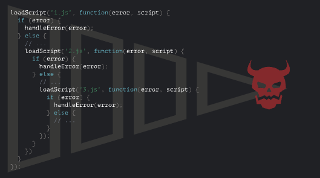
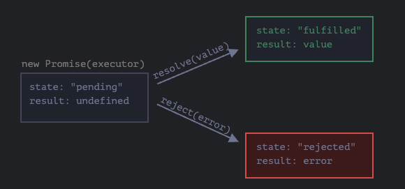
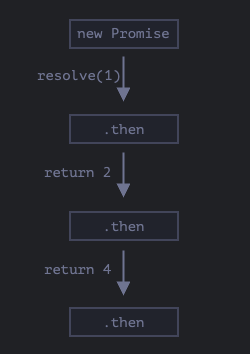
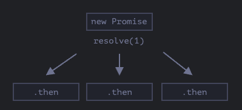
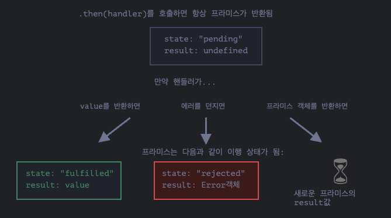

# 프라미스와 async, await

> (https://ko.javascript.info/async)를 정리한 내용입니다.

## 1. 콜백

- JavaScript 호스트 환경이 제공하는 여러 함수를 이용하면 비동기(asynchronous) 동작을 스케줄링 할 수 있다.
- 대표적으로 `setTimeout` 부터 스크립트와 모듈을 사용하는 것 등 다양하다.

```js
function loadScript(src) {
  let script = document.createElement("script");
  script.src = src;
  document.head.append(script);
}
```

- `loadScript` 함수는 스크립트 태그를 동적으로 만들고 문서에 추가하는 함수로 브라우저는 자동으로 태그에 있는 스크립트를 불러오고, 로딩이 완료되면 스크립트를 실행.

```js
loadScript("/my/script.js");
newFunction(); // script.js 내부 함수를 사용하면 에러 발생!
```

- 이 때 스크립트는 비동기적으로 실행.
- 로딩이 시작되더라도 실행은 함수가 끝난 후에 가능.
- 아래 코드들은 스크립트 로딩이 종료되길 기다리지 않음.
- 스크립트가 로딩되면 스크립트를 활용해 무언가 한다고 가정.
  - `loadScript` 함수를 호출하자마자 내부 함수를 호출하면 작동하지 않음.
  - 브라우저가 스크립트를 읽어올 수 있는 시간 확보가 되지 않아서 에러 발생.
  - 로딩이 끝난는지 여부를 확인할 필요가 있다.
- `loadScript` 함수의 두 번째 인수로 스크립트 로딩이 끝난 후 실행될 함수인 콜백 함수를 추가.

```js
function loadScript(src, callback) {
  let script = document.createElement("script");
  script.src = src;
  script.onload = () => callback(script);
  document.head.append(script);
}
```

```js
loadScript("/my/script", function () {
  newFunction(); // 정상 작동
});
```

- 새롭게 불러온 스크립트 내부 함수를 콜백 함수 안에서 호출하면 원하는 대로 외부 스크립트 안의 함수를 사용할 수 있음.
- 두 번째 인수로 전달된 함수(보통 익명함수)는 원하는 동작이 완료됐을 때 실행.
- 이런 방식은 콜백 기반 비동기 프로그래밍이라고 함.
- 무언가 비동기적으로 수행하는 함수는 함수 내 동작이 모두 처리된 후 실행되어야 하는 함수가 들어갈 콜백을 인수로 반드기 제공해야 함.

> 정리: 콜백 기반 비동기 프로그래밍에서 비동기적으로 수행하는 함수의 동작이 완료되었는지 알 수 있는 방법이 없기 때문에 이후에 실행되어야 하는 콜백 함수를 인수로 반드시 제공해야 한다.

### 콜백 속 콜백

- 스크립트가 두 개 있고 두 번째 스크립트 로딩은 첫 번째 스크립트의 로딩이 끝난 이후가 되질 원한다면 어떻게 해야 할까?

```js
loadScript("/my/script.js", function (script) {
  alert(`${script.src} 로딩 완료!`);
  loadScript("my/script2.js", function (script) {
    alert("두 번째 스크립트 로딩 완료!");
  });
});
```

- 중첩 콜백을 만들면 바깥에 위치한 `loadScript`가 완료된 후 안쪽 `loadScript`가 실행된다.
- 하지만 콜백 안에 콜백을 넣는 것은 수행하려는 동작이 몇 개뿐이라면 괜찮지만, 많은 경우 좋지 않다.
- 다른 방식으로 코드를 작성하는 방법은 곧 알아보도록 한다.

> 여러 콜백을 순차적으로 처리해야 하는 경우 콜백을 중첩시킬 수 있다.

### 에러 핸들링

- 지금까지의 `loadScript` 함수는 스크립트 로딩이 실패하는 경우 등의 에러를 고려하지 않았다.

```js
function loadScript(src, callback) {
  let script = document.createElement("script");
  script.src = src;

  script.onload = () => callback(null, script);
  script.onerror = () =>
    callback(new Error(`${src}를 불러오는 도중에 에러가 발생했습니다!`));

  document.head.append(script);
}
```

- 이제 `loadScript`는 로딩에 성공하면 `callback(null, script)`을, 실패하면 `callback(error)`을 호출한다.

```js
loadScript("/my/script.js", function (error, script) {
  if (error) {
    // 에러 처리
  } else {
    // 스크립트 로딩 성공
  }
});
```

- 이런 패턴을 오류 우선 콜백이라고 하고 다음 관례를 따른다.
  - `callback`의 첫 번째 인수는 에러를 위해 남겨둠. 에러가 발생하면 이 인수를 이용해 `callback(err)`이 호출됨.
  - 두 번째 인수(필요 시 더 추가할 수 있음)는 에러가 발생하지 않았을 때를 위해 남겨둠. 원하는 동작이 성공한 경우에는 `callback(null, result1, result2...)`이 호출됨.
- 오류 우선 콜백 스타일을 사용하면 단일 콜백 함수에서 에러 케이스와 성공 케이스를 모두 처리할 수 있다.

> 정리: 콜백 함수를 에러 처리하기 위해서 오류 우선 콜백을 사용한다. 오류 우선 콜백은 첫 번째 인수로 에러, 다음 인수로 성공 케이스를 위해 남겨둬 단이 콜백 함수에서 에러 케이스와 성공 케이스를 모두 처리할 수 있다.

### 멸망의 피라미드

- 콜백 기반 비동기 처리는 한 개 혹은 두 개의 중첩 호출이 있는 경우에는 나쁘지 않지만 비동기 동작이 많아지면 아래와 같은 코드 작성이 불가피해짐.

```js
loadScript("1.js", function (error, script) {
  if (error) {
    handleError(error);
  } else {
    loadScript("2.js", function (error, script) {
      if (error) {
        handleError(error);
      } else {
        loadScript("3.js", function (error, script) {
          if (error) {
            handleError(error);
          } else {
            // 계속 이어짐
          }
        });
      }
    });
  }
});
```

- 호출이 중첩되면서 코드가 깊어지고 중간에 반복문과 조건문이 있느 코드가 있으면 관리가 힘들어짐.
- 이렇게 깊은 중첩 코드가 만들어내는 패턴을 콜백 지옥, 멸망의 피라미드라고 불림.

;

- 비동기 동작이 하나씩 추가될 때마다 중첩 호출이 만들어내는 피라미드는 오른쪽으로 커짐.
- 이런 코딩 방식은 좋지 않으므로 각 동작을 동립적인 함수로 만들어 위와 같은 문제를 완화해보자.

```js
loadScript("1.js", step1);

function step1(error, script){
  if(error){
    handleError(error);
  }else{
    loadScript("2.js", step2)
  }
}

function step2(error, script){
  if(error){
    handleError(error)
  }else{
    loadScript("3.js", step3)
  }
}

...반복
```

- 콜백 기반 스타일 코드와 동일하게 동작하지만 각 동작을 분리해 최상위 레벨의 함수로 만들었기 때문에 깊은 중첩이 없다.
- 하지만 동작에는 문제가 없지만 코드가 찢어져 읽기 어려워짐.
- 게다가 콜백 헬을 해결하려는 용도로 만들어진 `step*` 함수들은 재사용이 불가능함.
- 콜백 헬을 피할 더 나은 방법으로 프라미스(promise)가 있다.

> 정리: 콜백 함수가 중첩되면 콜백 헬 또는 멸망의 피라미드가 만들어진다. 이를 해결할 방법으로 프라미스가 있다.

## 2. 프라미스

```js
let promise = new Promise(function (resolve, reject) {
  // executor
});
```

- `new Promise`에 전달되는 함수는 executor(실행자, 실행 함수)라고 부른다.
- executor는 `new Promise`에 의해 자동으로 그리고 즉각적으로 호출된다.
- executor는 인수 `resolve`와 `reject` 함수를 받는다.
- `resolve`, `reject` 함수는 자바스크립트 엔진이 미리 정의한 함수로 개발자가 따로 만들 필요가 없다.
- 대신 `resolve`와 `reject` 중 하나는 반드시 호출해야 한다.
  - `resolve(value)`: 일이 성공적으로 끝난 경우 그 결과를 나타내는 `value`와 함께 호출
  - `reject(error)`: 에러 발생 시 에러 객체를 나타내는 `error`와 함께 호출
- `new Promise` 생성자가 반환하는 `promise` 객체는 다음과 같은 내부 프로퍼티를 갖는다.
  - `state`: 처음엔 `pending`(보류)이었다 `resolve`가 호출되면 `fulfilled`, `reject`가 호출되면 `rejected`로 변한다.
  - `result`: 처음엔 `undefined`이었다 `resolve(value)`가 호출되면 `value`로, `reject(error)`가 호출되면 `error`로 변한다.
    

```js
let promise = new Promise(function (resolve, reject) {
  setTimeout(() => resolve("완료"), 1000);
});
```

- 일이 성공적으로 처리되었을 때의 프라미스는 fulfilled promise(약속이 이행된 프라미스)라고 불린다.

```js
let promise = new Promise(function (resolve, reject) {
  setTimeout(() => reject(new Error("에러 발생!")), 1000);
});
```

- `reject(...)`가 호출되면 `promise`의 상태가 `rejected`로 변한다.
- 이행(resolved) 혹은 거부(rejected) 상태의 프라미스는 settled promise(처리된 프라미스)라고 불리며 반대는 대기(pending) 상태의 프라미스가 있다.

#### 프라미스는 성공 또는 실패만 한다.

- executor는 `resolve`나 `reject` 중 하나를 반드시 호출해야 하고 변경된 상태는 더 이상 변하지 않는다.
- 처리가 끝난 프라미스에 `resolve`와 `reject`를 호출하면 무시된다.

```js
let promise = new Promise(function (resolve, reject) {
  resolve("완료!");

  reject(new Error("오류 발생!")); // 무시됨
  setTimeout(() => reject("완료2")); // 무시됨
});
```

- executor에 의해 처리가 끝난 일은 결과 혹은 에러만 가질 수 있다.
- `resolve`나 `reject`는 하나 혹은 아무것도 인수로 받지 않고 이 외의 인수는 무시한다.

#### Error 객체와 함께 거부하기

- 무언가 잘못된 경우, executor는 `reject`를 호출해야 한다.
- 이때 인수는 `resolve`와 마찬가지로 어던 타입도 가능하지만 `Error` 객체 또는 `Error`를 상속받은 객체를 사용하는 것을 추천한다. 이유는 뒤에서 설명.

#### resolve, reject 함수 즉시 호출하기

- executor는 대개 무언가를 비동기적으로 수행하고, 약간의 시간이 지난 후에 `resolve`, `reject`를 호출하는데, 즉시 호출할 수도 있다. 이렇게 하면 프라미스는 즉시 이행 상태가 된다.

```js
let promise = new Promise(function (resolve, reject) {
  // 일을 끝마치는 데 시간이 들지 않을 때
  resolve(123); // 결과(123)를 즉시 resolve에 전달
});
```

#### state와 result는 내부에 있다.

- 프라미스 객체의 `state`, `result` 프로퍼티는 내부 프로퍼티이므로 개발자가 직접 접근할 수 없다.
- `.then`, `.catch`, `.finally` 메서드를 사용하여 접근할 수 있다.

### then, catch, finally

- 프라미스 객체는 executor와 결과나 에러를 받을 소비 함수를 이어주는 역할을 한다.
- 소비 함수는 `.then`, `.catch`, `.finally` 메서드를 사용해 등록된다.

#### then

- 가장 중요하고 기본이 되는 메서드.

```js
promise.then(
  function(result){/* 결과(result)를 다룬다*/}
  function(error){/* 에러(error)를 다룬다*/}
)
```

- `.then`의 첫 번째 인수는 프라미스가 이행되었을 때 실행되는 함수고 실행 결과를 받는다.
- `.then`의 두 번째 인수는 프라미스가 거부되었을 대 실행되는 함수고 에러를 받는다.

- 프라미스가 이행된 경우

```js
let promise = new Promise(function (resolve, reject) {
  setTimeout(() => resolve("완료!"), 1000);
});

promise.then(
  (result) => alert(result), // 1초 후 "완료!"를 출력
  (error) => alert(error) // 실행되지 않음
);
```

- 프라미스가 거부된 경우

```js
let promise = new Promise(function (resolve, reject) {
  setTimeout(() => reject(new Error("에러 발생!")), 1000));
});

promise.then(
  (result) => alert(result), // 실행되지 않음
  (error) => alert(error) // 1초 후 "Error: 에러 발생!"을 출력
);
```

- 성공적으로 처리된 경우만 다룬다면 `then`에 하나의 인수만 전달하면 됨.

```js
let promise = new Promise(function (resolve, reject) {
  setTimeout(() => resolve("완료!"), 1000);
});

promise.then((result) => alert(result)); // 1초 뒤에 "완료!"를 출력
```

#### catch

- 에러가 발생한 경우만 다루고 싶다면 `.then(null, errorHandlingFunction)`같이 `null`을 첫 번째 인수로 전달하거나 `.catch(errorHandlingFunction)`을 써도 된다.

```js
let promise = new Promise((resolve, reject) => {
  setTimeout(() => reject(new Error("에러 발생!")), 1000);
});
```

#### finally

- 프라미스가 처리되면 `f`가 항상 실행된다는 점에서 `.finally(f)` 호출은 `.then(f, f)`와 유사하다.
- 결과가 어떻든 마무리가 필요하면 `finally`가 유용하다.

```js
new Promise((resolve, reject)=>{
  // 어떤 작업 수행 후 resolve, reject 호출
})
  .finally(()=> 로딩 인디케이터 중지)
  .then(result => result 보여줌, (error) => error 보여줌);
```

- 하지만 `.then(f, f)`와 완전히 같진 않다.

  - `finally` 핸들러엔 인수가 없으므로 결과를 알 수 없다. 절차를 마무리하는 보편적 동작을 수행하기 때문에 결과를 몰라도 된다.
  - `finally` 핸들러는 자동으로 다음 핸들러에 결과와 에러를 전달한다.

  ```js
  new Promise((resolve, reject) => {
    setTimeout(() => resolve("결과"), 2000);
  })
    .finally(() => alert("프라미스가 준비되었습니다."))
    .then((result) => alert(result)); // .then에서 result를 다룰 수 있음
  ```

  ```js
  new Promise((resolve, reject) => {
    setTimeout(() => reject(new Error("에러 발생!")), 2000);
  })
    .finally(() => alert("프라미스가 준비되었습니다."))
    .catch((error) => alert(error)); // .catch에서 에러 객체를 다룰 수 있음
  ```

  - `finally(f)`는 함수 `f`를 중복해서 쓸 필요가 없기 때문에 `.then(f, f)`보다 문법 측면에서 편리하다.

```js
function loadScript(src, callback) {
  let script = document.createElement("script");
  script.src = src;

  script.onload = () => callback(null, script);
  script.onerror = () =>
    callback(new Error(`${src}를 불러오는 도중에 에러가 발생함`));

  document.head.append(script);
}
```

- 앞서 콜백에서 봤던 예시를 프라미스를 이용해 다시 작성하면

```js
function loadScript(src) {
  return new Promise(function (resolve, reject) {
    let script = document.createElement("script");
    script.src = src;

    script.onload = () => resolve(script);
    script.onerror = () =>
      reject(new Error(`${src}를 불러오는 도중에 에러가 발생함!`));

    document.head.append(script);
  });
}
```

```js
let promise = loadScript("/my/script.js");

promise.then(
  (result) => alert(`${script.src}를 불러왔습니다!`),
  (resolve) => alert(`Error: ${error.message}`)
);

promise.then((script) => alert("또다른 핸들러..."));
```

- 프라미스를 사용한 코드가 콜백 기반 코드보다 나은 점
  - 프라미스 사용 시: 흐름이 자연스럽다. `loadScript(script)`로 스크립트를 읽고 결과에 따라 그 다음(`.then`)에 무엇을 할지에 대한 코드를 작성하면 된다.
  - 콜백 사용 시: `loadScript(script, callback)`를 호출할 때, 함께 호출할 `callback` 함수가 준비되어 있어야 한다. `loadScript`를 호출하기 이전에 호출 결과로 무엇을 할지 미리 알고 있어야 한다.
  - 프라미스는 원하는 만큼 `.then`을 호출할 수 있지만 콜백은 하나만 가능하다.
  - 이 외에도 더 많은 장점이 있는데 다음 챕터에서 살펴본다.

## 3. 프라미스 체이닝

- 콜백 챕터에서 언급된 순차적으로 처리해야 하는 비동기 작업이 여러 개있는 문제를 프라미스를 사용하여 해결해보자.
- 이번 챕터에서는 프라미스 체이닝(promise chaining)을 이용한 비동기 처리에 대해 다룬다.

```js
new Promise(function (resolve, reject) {
  setTimeout(() => resolve(1), 1000);
})
  .then(function (result) {
    alert(result);
    return result * 2;
  })
  .then(function (result) {
    alert(result);
    return result * 2;
  })
  .then(function (result) {
    alert(result);
    return result * 2;
  });
```

- 프라미스 체이닝은 `result`가 `.then` 핸들러의 체인을 통해 전달된다는 점에서 착안한 아이디어다.
  
- `result`가 핸들러 체인을 따라 전달되므로, `alert` 창엔 `1`, `2`, `4`가 순서대로 출려된다.
- 프라미스 체이닝이 가능한 이유는 `promise.then`을 호출하면 프라미스가 반환되기 때문이다.
- 한편 핸들러가 값을 반환할 때엔 이 값이 프라미스의 `result`가 된다. 따라서 다음 `.then`은 이 값을 이용해 호출된다.
- 프라미스 하나에 `.then`을 여러 개 추가한 것은 체이닝이 아니다.

  ```js
  let promise = new Promise(function (resolve, reject) {
    setTimeout(() => resolve(1), 1000);
  });

  promise.then(function (result) {
    alert(result); // 1
    return result * 2;
  });
  promise.then(function (result) {
    alert(result); // 1
    return result * 2;
  });
  promise.then(function (result) {
    alert(result); // 1
    return result * 2;
  });
  ```

  - 핸들러는 `result`를 순차적으로 전달하지 않고 독립적으로 처리된다.
    
  - 동일한 프라미스에 등록된 `.then` 모두는 동일한 결과를 받는다. 따라서 위 예시를 실행하면 모두 `1`이 출력된다.
  - 이런 식으로 한 프라미스에 여러 핸들러를 등록하는 경우는 거의 없고 주로 체이닝을 사용한다.

### loadScript 예시 개선하기

- 지금까지 배운 기능을 사용해 `loadScript`를 개선해보자

  ```js
  loadScript("1.js")
    .then(function (script) {
      return loadScript("2.js");
    })
    .then(function (script) {
      return loadScript("3.js");
    })
    .then(function (script) {
      // 불러온 스크립트 안에 정의된 함수를 호출
      one();
      two();
      three();
    });
  ```

- 화살표 함수를 활용하면 더 줄일 수 있다.

  ```js
  loadScript("1.js")
    .then((script) => loadScript("2.js"))
    .then((script) => loadScript("3.js"))
    .then((script) => {
      one();
      two();
      three();
    });
  ```

- 체인에 더 많은 비동기 동작을 추가해도 오른쪽으로 길어지지 않고 아래로만 증가해 콜백 헬이 만들어지지 않는다.
- 아래와 같이 각 `loadScript`에 `.then`을 바로 붙일 수도 있다.

  ```js
  loadScript("1.js").then((script1) => {
    loadScript("2.js").then((script2) => {
      loadScript("3.js").then((script3) => {
        one();
        two();
        three();
      });
    });
  });
  ```

- 동일한 동작을 하지만 코드가 오른쪽으로 길어져 콜백에서 언급한 문제와 동일한 문제가 발생한다.
- 프라미스 체이닝에 대해 잘 모른다면 위와 같이 코드를 작성할 수 있지만 대개 체이닝이 선호된다.
- 중첩 함수에서 외부 스코프에 접근할 수 있기 때문에 `.then`을 바로 쓰는 게 괜찮은 경우도 있지만 위 예제에서 가장 깊은 곳에 있는 중첩 콜백은 `script1`, `script2`, `script3` 안에 있는 변수 모두에 접근할 수 있는 예외 상황이 있다는 정도만 알아두자.

#### thenable

- 핸들러는 프라미스가 아닌 `thenable`이라 불리는 객체를 반환하기도 한다.
- `.then`이라는 메서드를 가진 객체는 모두 `thenable` 객체라고 부르는데, 이 객체는 프라미스와 같은 방식으로 처리된다.

```js
class Thenable {
  constructor(num) {
    this.num = num;
  }
  then(resolve, reject) {
    alert(resolve); // function () { 네이티브 코드 }
    setTimeout(() => resolve(this.num * 2), 1000);
  }
}

new Promise((resolve) => resolve(1))
  .then((result) => {
    return new Thenable(result);
  })
  .then(alert); // 1초 후에 2 출력
```

- 자바스크립트는 `.then` 핸들러가 반환한 객체를 확인하고 객체에 호출 가능한 메서드 `then`이 있으면 호출된다.
- `then`은 executor와 유사하게 `resolve`와 `reject`라는 네이티브 함수를 인수로 받고 둘 중 하나가 호출될 때까지 기다린다.
- 이런 식으로 `Promise`를 상속받지 않고 커스텀 객체를 사용해 프라미스 체이닝을 만들 수 있다.

### fetch와 체이닝 함께 응용하기

```js
let promise = fetch(url);
```

- 위 코드를 실행하면 `url`에 네트워크 요청을 보내고 프라미스를 반환한다.
- 원격 서버가 헤더와 함께 응답을 보내면 프라미스는 `response` 객체와 함께 이행된다.
- 그런데 이 때 response 전체가 완전히 다운로드되기 전에 프라미스는 이행 상태가 되어버린다.
- 응답이 완전히 종료되고, 응답 전체를 읽으려면 `response.text()`를 호출해야 한다.
- `response.text()`는 원격 서버에서 전송한 텍스트 전체가 다운로드되면, 이 텍스트를 `result`값으로 갖는 이행된 프라미스를 반환한다.
- 아래 코드를 실행하면 `user.json`에 요청이 가고 서버에서 해당 텍스트를 불러온다.

```js
fetch("/article/promise-chaining/user.json")
  // 원격 서버가 응답하면 .then 아래 코드가 실행된다.
  .then(function (response) {
    // response.text()는 응답 텍스트 전체가 다운로드되면 응답 텍스트를 새로운 이행 프라미스로 만들고 반환한다.
    return response.text();
  })
  .then(function (text) {
    // 원격에서 받아온 파일의 내용
    alert(text);
  });
```

- 하지만 `response.json()`을 쓰면 원격에서 받아온 데이터를 읽고 JSON으로 파싱할 수 있다.

```js
fetch("/article/promise-chaining/user.json")
  .then((response) => response.json())
  .then((user) => fetch(`http://api.github.com/users/${user.name}`))
  .then((response) => response.json())
  .then((githubUser) => {
    let img = document.createElement("img");
    img.src = githubUser.avatar_url;
    img.className = "promise-avatar-example";
    document.body.append(img);

    setTimeout(() => img.remove(), 3000);
  });
```

- 코드는 잘 작동하지만 프라미스를 다루는데 서툰 개발자가 자주 저지르는 잠재적인 문제가 내재돼 있다.
- 만약 아바타가 잠깐 보였다가 사라진 이후에 사용자 정보를 수정할 수 있는 폼을 보여주는 것 같은 작업을 추가하려면 지금으로선 방법이 없다.
- 체인을 확장할 수 있도록 만드려면 아바타가 사라질 때 이행 프라미스를 반환해줘야 한다.

```js
fetch("/article/promise-chaining/user.json")
  .then((response) => response.json())
  .then((user) => fetch(`http://api.github.com/users/${user.name}`))
  .then((response) => response.json())
  .then(
    (githubUser) =>
      new Promise(function (resolve, reject) {
        let img = document.createElement("img");
        img.src = githubUser.avatar_url;
        img.className = "promise-avatar-example";
        document.body.append(img);

        setTimeout(() => {
          img.remove();
          resolve(githubUser);
        }, 3000);
      })
  )
  .then((githubUser) =>
    alert(`${githubUser.name}의 이미지를 성공적으로 출력하였습니다.`)
  );
```

- 비동기 동작은 항상 프라미스를 반환하도록 하는 것이 좋다.
- 체인을 확장할 계획이 없더라도 이렇게 구현해 놓으면 나중에 체인 확장이 필요한 경우 손쉽게 확장할 수 있다.
- 코드를 재사용 가능한 함수 단위로 분리해보자.

```js
function loadJson(url) {
  return fetch(url).then((response) => response.json());
}

function loadGithubUser(name) {
  return fetch(`http://api.github.com/users/${user.name}`);
}

function showAvatar(githubUser) {
  return new Promise(function (resolve, reject) {
    let img = document.createElement("img");
    img.src = githubUser.avatar_url;
    img.className = "promise-avatar-example";
    document.body.append(img);

    setTimeout(() => {
      img.remove();
      resolve(githubUser);
    }, 3000);
  });
}

loadJson(/article/promise-chaining/user.json)
  .then(user => loadGithubUser(user.name))
  .then(showAvatar)
  .then(githubUser => alert(`Finished showing ${githubUser.name}`))
```

### 요약

- `.then` 또는 `.catch`, `.finally`의 핸들러가 프라미스를 반환하면, 나머지 체인은 프라미스가 처리될 때까지 대기한다.
- 처리가 완료되면 프라미스의 `result`(값 또는 에러)가 다음 체인으로 전달된다.
  

## 4. 프라미스와 에러 핸들링

- 프라미스가 거부되면 제어 흐름이 제일 가까운 rejection 핸들러로 넘어가기 때문에 프라미스 체인을 사용하여 쉽게 에러 처리를 할 수 있다.
- 존재하지 않은 주소를 `fetch`에 넘겨주는 경우

  ```js
  fetch("url 주소")
    .then((response) => response.json())
    .catch((err) => alert(err)); // 에러 출력!
  ```

  - `.catch`는 첫 번째 핸들러일 필요 없이 하나 혹은 여러 `.then` 뒤에 올 수 있다.

- 주소에는 문제가 없지만 응답으로 받은 JSON 형식이 잘못된 경우

  ```js
  fetch("/article/promise-chaining/user.json")
    .then((response) => response.json())
    .then((user) => fetch(`http://api.github.com/users/${user.name}`))
    .then((response) => response.json())
    .then(
      (githubUser) =>
        new Promise(function (resolve, reject) {
          let img = document.createElement("img");
          img.src = githubUser.avatar_url;
          img.className = "promise-avatar-example";
          document.body.append(img);

          setTimeout(() => {
            img.remove();
            resolve(githubUser);
          }, 3000);
        })
    )
    .then((githubUser) =>
      alert(`${githubUser.name}의 이미지를 성공적으로 출력하였습니다.`)
    )
    .catch((error) => alert(error.message));
  ```

  - 가장 쉬운 에러 처리 방법은 체인 끝에 `.catch`를 붙이는 것이다.
  - 정상적인 경우라면 `.catch`는 절대 트리거 되지 않지만 네트워크 문제, 잘못된 형식의 JSON 등으로 인해 위쪽 프라미스 중 하나라도 거부되면 `.catch`에서 에러를 잡게 된다.

### 암시적 try-catch

- 프라미스 executor와 프라미스 핸들러 코드 주위엔 보이지 않는(암시적) `try-catch`가 있다.
- 예외가 발생하면 암시적 `try-catch`에서 예오ㅓㅣㄹ를 잡고 이를 `reject`처럼 다룬다.

```js
new Promise((resolve, reject) => {
  throw new Error("에러 발생!");
}).catch(alert); // Error: 에러 발생!
```

- 위 예시는 아래와 동일하게 동작한다.

```js
new Promise((resolve, reject) => {
  reject(new Error("에러 발생!"));
}).catch(alert);
```

- executor 주위의 암시적 `try-catch`는 스스로 에러를 잡고,에러를 거부 상태의 프라미스로 변경시킨다.
- 이런 일은 executor 함수뿐만 아니라 `.then` 핸들러 안에서 에러를 던지면, 이 자체가 거부된 프라미스를 의미하여 가장 가까운 에러 핸들러로 넘어간다.
- `throw`문이 만든 에러뿐만 아니라 모든 종류의 에러가 암시적 `try-catch`에서 처리된다.

### 다시 던지기

- 체인의 마지막 `.catch`는 `try-catch`와 유사한 역할을 한다.
- 일반 `try-catch`에서는 에러를 분석하고, 처리할 수 없는 에러라 판단되면 에러를 다시 던질 때가 있다.
- 프라미스에서도 `.catch` 안에서 에러가 성공적으로 처리되면 가장 가까운 곳에 있는 `.then` 핸들러로 흐름이 넘어가 실행된다.
  ```js
  new Promise((resolve, rejct) => {
    throw new Error("에러 발생!");
  })
    .catch(function (error) {
      alert("에러가 잘 처리됐습니다. 정상적으로 실행이 이어집니다.");
    })
    .then(() => alert("다음 핸들러가 실행됩니다."));
  ```
- `.catch`를 활용한 또 다른 사례
  ```js
  new Promise((resolve, reject) => {
    throw new Error("에러 발생!");
  })
    .catch(function (error) {
      if (error instanceof URIError) {
        // 에러 처리
      } else {
        alert("처리할 수 없는 에러!");
        throw error;
      }
    })
    .then(function () {
      // 실행되지 않음
    })
    .catch((error) => {
      alert(`알 수 없는 에러가 발생: ${error}`);
      // 반환값이 없으므로 계속 실행
    });
  ```

### 처리되지 못한 거부

- 에러를 처리하지 못하면 무슨 일이 일어날까?
- 체인 끝에 `.catch`를 추가하지 못한 경우 프라미스는 거부 상태가 되지만 처리해 줄 핸들러가 없어서 에러가 갇혀버린다.
- 자바스크립트 엔진은 프라미스 거부를 추적하다가 전역 에러를 생성한다.
- 브라우저 환경에서는 이런 에러를 `unhandledrejection` 이벤트로 처리할 수 있다.

  ```js
  window.addEventListener("unhandledrejection", function (event) {
    // unhandledrejection 이벤트에는 두 개의 특수 프로퍼티가 있다.
    alert(event.promise); // 에러를 생성하는 프라미스
    alert(event.reason); // 처리하지 못한 에러 객체
  });

  new Promise(function () {
    throw new Error("에러 발생!");
  });
  ```

- `unhandledrejection` 이벤트는 HTML 명세서에 정의된 표준 이벤트이다.
- 대개 이런 에러는 회복할 수 없기 때문에 개발자로서 할 수 있는 최선의 방법은 사용자에게 문제 상황을 알리고 가능하면 서버에 에러 정보를 보내는 것이다.

### 요약

- `.catch`는 프라미스에서 발생한 모든 에러를 다루고 `reject`가 호출되거나 에러가 던져지면 이를 처리한다.
- `.catch`는 에러를 처리하고 싶은 지점에 정확히 위치시켜야 하고 핸들러에선 에러를 분석하고 알 수 없는 에러는 다시 던질 수 있다.
- 에러 발생 시 회복할 방법이 없다면 `.catch`를 사용하지 않고 `unhandledrejection` 이벤트를 사용해 사용자 혹은 서버에게 알려서 그냥 죽는 걸 방지해야 한다.

```js
new Promise(function (resolve, reject) {
  setTimeout(() => {
    throw new Error("에러 발생!");
  }, 1000);
}).catch(alert);
```

- 위 예시에서 `.catch`는 트리거 되지 않는다.
- 암시적 `try-catch`가 함수 코드를 감싸고 있으므로 모든 동기적 에러는 처리되지만 executor가 실행되는 동안이 아니라 나중에 발생하기 때문에 프라미스는 에러를 처리할 수 없다.

## 5. 프라미스 API

- `Promise` 클래스에는 5가지 정적 메서드가 있다.

### Promise.all

- 여러 개의 프라미스를 동시에 실행시키고 모든 프라미스가 준비될 때까지 기다릴 때 `Promise.all`을 사용할 수 있다.

```js
let promise = new Promise.all([...promises...])
```

- `Promise.all`은 요소 전체가 프라미스인 배열(엄밀히 따지면 이터러블 객체)을 받고 새로운 프라미스를 반환한다.
- 배열 안 프라미스가 모두 처리되면 새로운 프라미스가 이행되는데, 배열 안 프라미스의 결괏값을 담은 배열이 새로운 프라미스의 `result`가 된다.
- 아래 `Promise.all`은 3초 후에 처리되고, 반환되는 프라미스의 `result`는 배열 `[1, 2, 3]`이 된다.
  ```js
  Promise.all([
    new Promise((resolve) => setTimeout(() => resolve(1), 3000)), // 1
    new Promise((resolve) => setTimeout(() => resolve(2), 2000)), // 2
    new Promise((resolve) => setTimeout(() => resolve(3), 1000)), // 3
  ]).then(alert);
  ```
  - `Promise.all`의 첫 번째 프라미스가 가장 늦게 이행되더라도 처리 결과는 배열의 첫 번째 요소에 저장된다.
- `Promise.all`에 전달되는 프라미스 중 하나라도 거부되면, `Promise.all`이 반환하는 프라미스는 에러와 함께 바로 거부된다.
  ```js
  Promise.all([
    new Promise((resolve, reject) => setTimeout(() => resolve(1), 3000)),
    new Promise((resolve, reject) =>
      setTimeout(() => reject(new Error("에러 발생!")), 2000)
    ),
    new Promise((resolve, reject) => setTimeout(() => resolve(3), 1000)),
  ]).catch(alert); // Error: 에러 발생!
  ```
  - 프라미스가 하나라도 거부되면 `Promise.all`은 즉시 거부되고 배열에 저장된 다른 프라미스의 결과는 이행된 프라미스라도 무시한다.
  - `fetch`를 사용해 호출 여러 개를 만들면, 그 중 하나가 싪패하더라도 호출은 계속 일어난다. 하지만 `Promise.all`은 다른 호출을 더는 신경쓰지 않고 프라미스가 처리되긴 하겠지만 결과는 무시한다.
  - 프라미스에는 취소라는 개념이 없어서 `Promise.all`도 프라미스를 취소하지 않는다. 또 다른 챕터에서 배울 `AbortController`를 사용하면 프라미스 취소가 가능하긴 하지만 `AbortController`는 프라미스 API가 아니다.
  - `Promise.all(...)`은 대개 프라미스가 요소인 이터러블 객체를 받지만 프라미스가 아닌 객체일 경우 요소 그대로 결과 배열에 전달한다.
  ```js
  Promise.all([
    new Promise((resolve, reject) => {
      setTimeout(() => resolve(1), 1000);
    }),
    2,
    3,
  ]).then(alert); // 1, 2, 3
  ```

### Promise.allSettled

- 스펙에 추가된지 얼마 안 된 문법으로 구형 브라우저는 폴리필이 필요하다.
- `Promise.all`은 프라미스가 하나라도 거절되면 전체를 거절하지만 `Promise.allSettled`는 모든 프라미스가 처리될 때까지 기다리고 반환되는 배열은 다음과 같은 요소를 갖는다.
  - 응답이 성공할 경우: `{status: "fulfilled", value: result}`
  - 에러가 발생한 경우: `{status: "rejected", reason: error}`

```js
let urls = [
  "https://api.github.com/users/iliakan",
  "https://api.github.com/users/Violet-Bora-Lee",
  "https://no-such-url",
];

Promise.allSettled(urls.map((url) => fetch(url))).then((results) => {
  results.forEach((result, num) => {
    if (result.status == "fulfilled") {
      alert(`${urls[num]}: ${result.value.status}`);
    }
    if (result.status == "rejected") {
      alert(`${urls[num]}: ${result.reason}`);
    }
  });
});
```

- `Promise.allSettled`를 사용하면 각 프라미스의 상태와 값 또는 에러를 받을 수 있다.

### Promise.race

```js
let promise = Promise.race(iterable);
```

- `Promise.race`는 `Promise.all`과 비슷하지만 가장 먼저 처리되는 프라미스의 결과 혹은 에러를 반환한다.

```js
Promise.all([
  new Promise((resolve, reject) => setTimeout(() => resolve(1), 1000)),
  new Promise((resolve, reject) =>
    setTimeout(() => reject(new Error("에러 발생!")), 2000)
  ),
  new Promise((resolve, reject) => setTimeout(() => resolve(3), 3000)),
]).then(alert); // 1
```

- `Promise.race`를 사용하면 경주(race)에 승자가 나타난 순간 다른 프라미스의 결과 또는 에러는 무시된다.

### Promise.resolve와 Promise.reject

- `Promise.resolve`와 `Promise.reject`는 `async/await` 문법이 생긴 후로 쓸모없어졌기 때문에 근래에는 거의 사용되지 않는다.

## 6. 프라미스화

## 7. 마이크로태스크

## 8. async와 await
