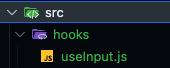

# Custom Hooks

```jsx
// src/App.jsx

import React from "react";
import { useState } from "react";

const App = () => {
  // input의 갯수가 늘어날때마다 state와 handler가 같이 증가한다.
  const [title, setTitle] = useState("");
  const onChangeTitleHandler = (e) => {
    setTitle(e.target.value);
  };

  // input의 갯수가 늘어날때마다 state와 handler가 같이 증가한다.
  const [body, setBody] = useState("");
  const onChangeBodyHandler = (e) => {
    setBody(e.target.value);
  };

  return (
    <div>
      <input
        type="text"
        name="title"
        value={title}
        onChange={onChangeTitleHandler}
      />
      <input
        type="text"
        name="title"
        value={body}
        onChange={onChangeBodyHandler}
      />
    </div>
  );
};

export default App;
```

- 위 코드는 `input`을 구현하고 `useState`로 각 `input`의 `value`를 관리하는 아주 친숙한 코드다.
- 아쉬운 부분은 `input` 개수가 증가하면 `useState`와 이벤트 핸들러도 같이 증가하고 그로 인해 코드 중복이 생긴다는 점이다.
- 리액트에서는 위 예시처럼 반복되는 로직이나 중복되는 코드를 커스텀 훅을 통해서 관리할 수 있다.
- 리액트에서 제공하는 `useState`, `useEffect`와 같은 내장 훅을 사용해서 우리만의 훅을 만드는 것이다.

## useInput

- 처음으로 만들 커스텀 훅은 `useInput`이다.
- 커스텀 훅을 만들 때 이름은 마음대로 해도 상관이 없으나, 파일의 이름 앞에 `use`라는 키워드를 붙여줘야 한다.

### 폴더 구조

- `src` 폴더에 보통 `hooks`라는 폴더를 생성해서 커스텀 훅들을 보관하는 식으로 많이 사용되고 있다.



## 코드 구현

```js
import React, { useState } from "react";

const useInput = () => {
  const [value, setValue] = useState("");

  const handler = (e) => {
    setValue(e.target.value);
  };

  return [value, handler];
};

export default useInput;
```

```jsx
import React from "react";
import useInput from "./hooks/useInput";

const App = () => {
  const [title, onChangeTitleHandler] = useInput();
  const [body, onChangeBodyHandler] = useInput();

  return (
    <div>
      <input
        type="text"
        name="title"
        value={title}
        onChange={onChangeTitleHandler}
      />
      <input
        type="text"
        name="title"
        value={body}
        onChange={onChangeBodyHandler}
      />
    </div>
  );
};

export default App;
```

- 기능은 커스텀 훅을 만들기 전과 동일하게 작동하되, 중복코드가 사라지고 전체적인 코드의 양도 감소했다.
- 앞으로 기능을 구현하면서 중복되는 로직이 있으면 "이것을 어떻게 훅으로 빼볼 수 있을까"라고 생각해보는 습관을 가지면 좋다.

## 정리

- 커스텀훅이란 리액트 훅을 이용해서 공통된 로직이나 기능을 별도로 분리한 훅을 말한다.
- 파일의 이름 앞에 반드시 `use`라는 키워드가 들어가야 한다.
