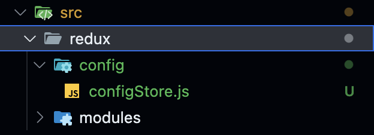
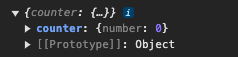
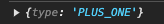

# Redux

## Redux 설정

### 리덕스 설치

```bash
yarn add redux react-redux
```

- 리액트에서 리덕스를 사용하기 위해서는 2개의 패키지를 설치해야 한다.
- `react-redux` 패키지는 리덕스를 리액트에서 사용할 수 있도록 서로 연결시켜주는 패키지입니다.

### 폴더 구조 생성하기



1. `src` 폴더 안에 `redux` 폴더 생성.
2. `redux` 폴더 안에 `config`, `modules` 폴더 생성
3. `config` 폴더 안에 `configStore.js` 파일 생성.

- 각 폴더와 파일의 역할
  - `redux`: 리덕스와 관련된 코드를 모두 놓을 폴더.
  - `config`: 리덕스 설정과 관련된 파일들을 놓는 폴더.
  - `configStore`: "중앙 state 관리소"인 `Store`를 만드는 설정 코드들이 있는 파일.
  - `modules`: `State`들의 그룹이라고 생각하면 된다. 예를 들어 투두리스트를 만든다고 한다면, 투두리스트에 필요한 `state`들이 모두 모여있을 `todos.js`를 생성하게 될텐데, 이 `todos.js` 파일이 곧 하나의 모듈이 된다.

### 설정 코드 작성

- src/configStore.js

```js
import { createStore } from "redux";
import { combineReducers } from "redux";

/*
1. createStore()
리덕스의 가장 핵심이 되는 스토어를 만드는 메소드(함수) 입니다. 
리덕스는 단일 스토어로 모든 상태 트리를 관리한다고 설명해 드렸죠? 
리덕스를 사용할 시 creatorStore를 호출할 일은 한 번밖에 없을 거예요.
*/

/*
2. combineReducers()
리덕스는 action —> dispatch —> reducer 순으로 동작한다고 말씀드렸죠? 
이때 애플리케이션이 복잡해지게 되면 reducer 부분을 여러 개로 나눠야 하는 경우가 발생합니다. 
combineReducers은 여러 개의 독립적인 reducer의 반환 값을 하나의 상태 객체로 만들어줍니다.
*/

const rootReducer = combineReducers({});
const store = createStore(rootReducer);

export default store;
```

- index.js

```js
// 원래부터 있던 코드
import React from "react";
import ReactDOM from "react-dom/client";
import App from "./App";
import reportWebVitals from "./reportWebVitals";

// 우리가 추가할 코드
import store from "./redux/config/configStore";
import { Provider } from "react-redux";

const root = ReactDOM.createRoot(document.getElementById("root"));
root.render(
  //App을 Provider로 감싸주고, configStore에서 export default 한 store를 넣어줍니다.
  <Provider store={store}>
    <App />
  </Provider>
);

reportWebVitals();
```

## Redux 소개

### 리덕스가 필요한 이유

1. `useState`의 불편함
   - 컴포넌트에서 컴포넌트로 `State`를 보내기 위해서는 반드시 부-모 관계가 되어야 한다.
   - 조부모 컴포넌트에서 손자 컴포넌트로 값을 보내고자 할때도 부모 컴포넌트에서는 그 값이 필요가 없어도 반드시 부모 컴포넌트를 거쳐야만 한다.
   - 자식 컴포넌트에서 부모 컴포넌트로 값을 보낼 수 없다.

- 리덕스를 사용하면 `State`를 궁유하고자 할때 부-모 관계가 아니여도 되고, 중간에 의미없이 컴포넌트를 거치지 않아도 된다.
- 자식 컴포넌트에서 만든 `State`를 부모 컴포넌트에서도 사용할 수 있다.

2. Global state와 Local state

- Local state (지역 상태): 컴포넌트에서 `useState`를 이용해서 생성한 `state`로 좁은 범위 안에서 생성된 `State`라고 생각하면 된다.
- Global state (전역 상태): 컴포넌트에서 생성되지 않고 중앙화 된 특별한 곳에서 `State`들이 생성된다. 쉽게 얘기해서 "중앙 state 관리소"라고 생각하면 된다.
- 중앙 State 관리소에서 `State`를 생성하고, 만약 어떤 컴포넌트가 `State`가 필요하다면 컴포넌트가 어디에 위치하고 있든 상관없이 `State`를 불러와서 사용할 수 있게 된다.
- 이렇게 특정 컴포넌트에 종속되어 있는 것이 아닌, 중앙 state 관리소에서 생성된 `State`를 `Global state`라고 하고 이러한 값들을 관리하는 것을 전역 상태 관리라고 한다.

### 리덕스란 무엇인가?

- 위에서 말한 "중앙 state 관리소"를 사용할 수 있게 도와주는 패키지(라이브러리)다.
- 전역 상태 관리 라이브러리라고 많이 표현한다.

### 정리

- 리덕스는 전역상태 관리 라이브러리이다.
- 리덕스는 `useState`를 통해 상태를 관리했을 때 발생하는 불편함을 일부 해소시켜준다.
- 리덕스는 `중앙 State 관리소`를 가지고 있으며, 모든 `State`는 이곳에서 생성된다.
- `useState`로 생성한 `State`는 `Local State`이고, 리덕스에서 생성한 `State`는 `Global State`다.

## Redux - 카운터 프로그램 만들기

### 1. 모듈 만들기

- 모듈이란, `State`의 그룹이다.
- 첫 모듈은 카운터 프로그램에 필요한 `State`들이 모여있는 모듈이 될 것이다.

1. `module` 폴더에 `counter.js` 파일을 생성한다.
2. 코드를 작성한다.

   ```js
   const initialState = {
     number: 0,
   };

   const counter = (state = initialState, action) => {
     switch (action.type) {
       default:
         return state;
     }
   };

   export default counter;
   ```

### 2. 모듈 구성요소 살펴보기

- initialState === 초기 상태값

  ```js
  const initialState = {
    number: 0,
  };
  ```

  - 어떤 `State`의 초기값을 정해주는 것이다.
  - 우리가 `useState`를 사용했을 때 괄호 안에 초기값을 지정해주던 것과 같다.
  - 코드에서 만든 `State`의 초기값은 객체이고, 그 안에 `number`라는 변수에 초기값 `0`을 할당해줬다.
  - 초기값은 꼭 객체가 아니어도 된다. 배열이어도 되고, 원시 데이터가 돼도 된다. 그리고 객체에도 여러 변수를 넣어줄 수 있다.

  ```js
  const initialState = 0;

  const initialState = [0];

  const initialState = {
    number: 0,
    name: "원정",
  };
  ```

- Reducer === 변화를 일으키는 함수

  ```js
  const counter = (state = initialState, action) => {
    switch (action.type) {
      default:
        return state;
    }
  };
  ```

  - 위 코드를 리듀서라고 한다.
  - 리듀서란, 변화를 일이키는 `함수`이다.
  - 우리가 `useState`를 사용할 때, `number`라는 값을 바꾸고 싶으면 `setNumber`를 사용한 것처럼 리덕스에서는 리듀서가 이 역할을 한다.
  - 리듀서의 인자에 보면 `(state = initialState, action)`이라고 되어 있다.
  - 리듀서 인자 첫 번째 자리에 `state`를, 두 번째 자리에 `action`을 꺼내서 사용할 수 있다.
  - 이것이 무엇인지는 지금 당장 몰라도 되지만, `state = initialState`처럼 `state`에 `initialState`를 할당해줘야 하는 것만 기억하자.

- 카운터 모듈을 스토어에 연결하기

  - 우리는 지금까지 모듈에서 초기 상태값과 리듀서를 작성했다.
  - 이제 우리가 만든 모듈을 스토어에 연결시켜야 한다.
  - 아직까진 모듈과 스토어가 분리되어 있는 상태이기 때문에 우리가 만든 `State`를 스토어에서 꺼낼 수 없다.
  - configStore.js

    ```js
    import { createStore } from "redux";
    import { combineReducers } from "redux";

    import counter from "../modules/counter";

    const rootReducer = combineReducers({
      counter: counter,
    });
    const store = createStore(rootReducer);

    export default store;
    ```

    - 위와 같이 코드를 추가하면, 스토어와 모듈이 연결된다.
    - 이렇게 스토어와 모듈을 연결시키는 코드는 우리가 모듈을 추가할 때마다 똑같이 진행해주면 된다.

### 3. 스토어와 모듈 연결 확인하기

- useSelector === 스토어 조회

  - 우리가 생성한 모듈을 스토어에 잘 연결했는지 확인하는 방법은 컴포넌트에서 스토어를 직접 조회하면 된다.
  - 컴포넌트에서 리덕스 스토어를 조회하고자 할 때는 `useSelector`라는 `react-redux`의 훅을 사용해야 한다.

  ```js
  const number = useSelector((state) => {
    return state;
  });
  ```

  - `App.js` 컴포넌트로 이동해서 스토어를 조회해보자.

  ```js
  import { useSelector } from "react-redux";
  import "./App.css";

  function App() {
    const counterStore = useSelector((state) => state);
    console.log(counterStore);

    return <div></div>;
  }

  export default App;
  ```

  - 콘솔을 확인하면 객체가 보이고, 그 안에 `counter`라는 값이 있는 것을 볼 수 있다.
  - 우리가 만든 `counter`라는 모듈의 `state`가 보이는 것을 알 수 있다.
  - 이렇게 화살표 함수에서 꺼낸 `state`라는 인자는 현재 프로젝트에 존재하는 모든 리덕스 모듈의 `state`이다.
    
  - 만약 컴포넌트에서 `number`라는 값을 사용하고자 한다면 `const number = useSelector(state => state.counter.number)`로 꺼내서 사용할 수 있다.

### 4. counter.js 모듈의 state 수정 기능 만들기 (+1 기능 구현해보기)

- 리듀서에서 `counter.js` 모듈에 있는 `number`에 `+ 1`을 하고 싶으면 어떻게 해야할까?
  1. 리듀서에게 보낼 `number`를 `+1`하라는 명령을 만든다.
  2. 명령을 보낸다.
  3. 리듀서에서 명령을 받아 `number + 1`을 한다.
- 리듀서에게 보낼 명령 만들기

  - 리덕스에서는 명령을 `Action`이라고 한다.
  - 행동을 코드로 나타내면 객체로 만들고 이것을 액션 객체라고 한다.
  - 액션 객체는 반드시 `type`이라는 `key`를 가져야 한다. 왜냐하면 우리가 이 액션 객체를 리듀서에게 보냈을 때 리듀서는 객체 안에서 `type`이라는 `key`를 보기 때문이다.

    ```js
    {
      type: "PLUS_ONE";
    }
    ```

  - 앞으로 우리는 리덕스 모듈에 있는 `state`를 변경하기 위해서는 그에 해당하는 액션 객체를 모두 만들어줘야 한다.

- 액션 객체 보내기

  - 이제 액션 객체를 만들었으니 리듀서에게 보내야 한다.
  - 액션 객체를 리듀서로 보내기 위해서는 `useDespatch`라는 훅을 사용해야 한다.
  - `react-redux`에서 `import`해서 사용할 수 있으며, 우리가 만든 액션 객체를 리듀서로 보내주는 역할을 하는 훅이다.
  - `useDispatch`라는 훅을 사용하기 위해서는 컴포넌트 안에서 아래와 같이 먼저 코드를 작성해서 `dispatch`라는 변수를 생성해줘야 한다.

    ```jsx
    import React from "react";
    import { useDispatch } from "react-redux";

    const App = () => {
      const dispatch = useDispatch();
      return (
        <div>
          <button> + 1</button>
        </div>
      );
    };

    export default App;
    ```

  - 이렇게 생성한 `dispatch`는 함수라는 점을 기억하자.

- `dispatch`를 사용할 때 () 안에 액션 객체를 넣어주면 된다.
- 만약 어떤 버튼을 클릭했을 때 리듀서로 액션 객체를 보내고 싶다면 아래와 같이 코드를 작성한다.

  ```jsx
  import React from "react";
  import { useDispatch } from "react-redux";

  const App = () => {
    const dispatch = useDispatch();
    return (
      <div>
        <button
          onClick={() => {
            dispatch({ type: "PLUS_ONE" });
          }}
        >
          {" "}
          + 1
        </button>
      </div>
    );
  };

  export default App;
  ```

  - 이렇게 디스패치를 이용해서 액션 객체를 리듀서로 보낼 수 있다.

### 5. 액션 객체 받기

- 액션 객체를 리듀서로 보냈으니, 리듀서에서 액션 객체가 잘 왔는지 확인해보겠습니다.

```jsx
const initialState = {
  number: 0,
};

const counter = (state = initialState, action) => {
  console.log(action); // 여기에 console.log(action) 추가
  switch (action.type) {
    default:
      return state;
  }
};

export default counter;
```

- 리듀서에서 `action`을 콘솔로 찍어보고 `App.js`에서 버튼을 클릭하면 `disaptch`로 보낸 액션 객체임을 알 수 있다.



### 6. 액션 객체 명령대로 리듀서가 state값을 변경하는 코드 구현하기

- 이제 액션 객체를 잘 보내고, 잘 받고 있음을 확인했으니 `state`에 있는 `number`를 실제로 변경하는 로직 코드를 구현해보자.
- 로직 코드는 리듀서 안에 있는 스위치문으로 작성된다.
- 리듀서가 액션 객체를 받아 상태를 바꾸는 원리는 아래와 같다.
  1. 컴포넌트로부터 `dispatch`를 통해 액션 객체를 전달 받는다.
  2. `action` 안에 있는 `type`을 스위치문을 통해 하나씩 검사해서 일치하는 `case`를 찾는다.
  3. `type`과 `case`가 일치하는 경우에, 해당 코드가 실행되고 새로운 `state`를 반환한다.
  4. 리듀서가 새로운 `state`를 반환하면, 그게 새로운 모듈의 `state`가 된다.
- 코드로 작성해보자.

```jsx
const initialState = {
  number: 0,
};

const counter = (state = initialState, action) => {
  console.log(action);
  switch (action.type) {
    case "PLUS_ONE":
      return {
        number: state.number + 1,
      };
    default:
      return state;
  }
};

export default counter;
```

### 7. useSelector로 변경된 state값 확인하기

```jsx
import React from "react";
import { useDispatch, useSelector } from "react-redux";

const App = () => {
  const dispatch = useDispatch();

  const number = useSelector((state) => state.counter.number);

  console.log(number);
  return (
    <div>
      {number}
      <button
        onClick={() => {
          dispatch({ type: "PLUS_ONE" });
        }}
      >
        {" "}
        + 1
      </button>
    </div>
  );
};

export default App;
```

- 의도한대로 버튼을 누를때마다 `number`가 `1`씩 증가하는 것을 볼 수 있다.
- `useState`에서 만든 `state`가 변경되면 화면이 리렌더링되는 것과 마찬가지로, 리덕스에 존재하는 `state`도 값이 변경되면 `useSelector`를 하고 있는 컴포넌트들도 모두 다시 리렌더링된다.

### 정리

- 액션 객체란 반드시 `type`이란 `key`를 가져야 하는 객체이자 리듀서로 보낼 명령이다.
- 디스패치란, 액션 객체를 리듀서로 보내는 전달자 함수이다.
- 리듀서란, 디스패치를 통해 전달받은 액션 객체를 검사하고, 조건이 일치했을 때 새로운 상태값을 만들어내는 "변화를 만들어내는" 함수이다.
- 디스패치를 사용하기 위해서는 `useDispatch`라는 훅을 이용해야 한다.
  - 디스패치는 스토어의 내장 함수 중 하나다.
  - 우선, 디스패치는 액션을 발생 시키는 것 정도로 이해하면 된다.
  - 디스패치라는 함수에는 액션을 파라미터로 전달한다.
- 액션 객체 `type`의 `value`는 대문자로 작성한다.

## Refactoring(action creators, action values)

### Action Creator

- 액션 객체의 `value`를 변경할 일이 생긴다면 `PLUS_ONE`, `MINUS_ONE` 이라는 `value` 대신 이 액션 객체가 `counter` 모듈 안에 있다는 것을 강조하기 위해서 `counter/PLUS_ONE`, `counter/MINUS_ONE`이라는 `value`로 바꾸길 원한다면 아래 코드에서 4군데를 변경해줘야 한다.

```jsx
import React from "react";
import { useDispatch, useSelector } from "react-redux";

const App = () => {
  const dispatch = useDispatch();
  const number = useSelector((state) => state.counter.number);

  return (
    <div>
      {number}
      <button
        onClick={() => {
          dispatch({ type: "PLUS_ONE" }); // counter/PLUS_ONE로 변경
        }}
      >
        + 1
      </button>
      <button
        onClick={() => {
          // 액션객체 디스패치
          dispatch({ type: "MINUS_ONE" }); // counter/MINUS_ONE로 변경
        }}
      >
        - 1
      </button>
    </div>
  );
};

export default App;
```

```jsx
// 초기 상태값
const initialState = {
  number: 0,
};

// 리듀서
const counter = (state = initialState, action) => {
  switch (action.type) {
    case "PLUS_ONE": // counter/PLUS_ONE로 변경
      return {
        number: state.number + 1,
      };

    // action.type이 MINUS_ONE 일 때 새로운 state 반환
    case "MINUS_ONE": // counter/MINUS_ONE로 변경
      return {
        number: state.number - 1,
      };
    default:
      return state;
  }
};

// 모듈파일에서는 리듀서를 export default 한다.
export default counter;
```

- 하지만 프로젝트 규모가 커서 100군데라면 곤란하다.
- 그래서 앞으로는 위 코드처럼 직접 하드 코딩하는 것이 아닌, 액션 객체를 한 곳에서 관리할 수 있도록 함수와 액션 `value`를 상수로 만들어보자.
- 만약 `PLUS_ONE`이라는 액션 객체를 만드는 함수를 만든다면 아래와 같이 만들 수 있고 이를 Action Creator라고 부른다.

```jsx
const PLUS_ONE = "PLUS_ONE";

export const plusOne = () => {
  return {
    type: PLUS_ONE,
  };
};
```

- 이렇게 액션의 `value`는 상수로 따로 만들어주고, 그리고 그것을 이용해 액션 객체를 반환하는 함수를 작성한다.
- 그리고 이것을 실제로 리듀서와 컴포넌트에 아래와 같이 작성한다.

```jsx
const PLUS_ONE = "PLUS_ONE";
const MINUS_ONE = "MINUS_ONE";

export const plusOne = () => {
  return {
    type: PLUS_ONE,
  };
};

export const minusOne = () => {
  return {
    type: MINUS_ONE,
  };
};

const initialState = {
  number: 0,
};

const counter = ((state = initialState), action) => {
    switch(action.type){
        case PLUS_ONE:
            return {
                number: state.number + 1
            }
        case MINUS_ONE:
            return {
                number: state.number - 1
            }
        default:
            return state
    }
};

export default counter
```

- 사용하는 방법은 아래 순서로 진행한다.
  1. `export`된 Action Creator `import`하기
  2. `dispatch`에 있던 액션 객체를 지우고 Action Creator 넣기

```jsx
import React from "react";
import { useDispatch, useSelector } from "react-redux";
import { minusOne, plusOne } from "./redux/modules/counter";

const App = () => {
  const dispatch = useDispatch();
  const number = useSelector((state) => state.counter.number);

  console.log(number);
  return (
    <div>
      <button onClick={() => dispatch(minusOne())}>- 1</button>
      {number}
      <button
        onClick={() => {
          dispatch(plusOne());
        }}
      >
        + 1
      </button>
    </div>
  );
};

export default App;
```

### 왜 Action Creator를 사용해야 하나?

1. 휴먼에러(오타) 방지
   - 액션 객체의 `type` `value`를 상수로 만들어놓았기 때문에, 개발툴에서 자동 완성 등의 보조 기능을 지원받을 수 있고 의도치 않은 휴먼 에러를 없앨 수 있다.
2. 유지 보수의 효율성 증가
   - 우리가 만든 Action Creator가 만약 100군데에서 쓰이고 있는 상태에서 바꾸어야 하는 상환이 오더라도 단 한번의 수정으로 100군데에 모든 수정 사항을 반영할 수 있다.
3. 코드 가독성
   - 모듈 파일에서 Action Creator가 일목요연하게 정리가 되어 있으면, 다른 개발자가 보았을 때 해당 모듈이 가지고 있는 모든 `Action`들을 한 눈에 알 수 있다. 즉, 그 자체가 `Action`들의 리스트업을 해주는 역할을 갖게 된다.
4. 리덕스 공식 문서에서 소개되고 있는 방법

### 정리

- 액션 객체를 만드는 함수를 Action Creator라고 한다.
- Action Creator는 모듈 파일 안에서 생성된다.
- 액션 객체의 `type` `value`를 상수로 생성해서 관리한다.
- Action Creator를 사용하면, 여러 문제점을 해소할 수 있다.

## Payload 및 Duck 패턴

### Payload란?

- `PLUS_ONE` 명령을 내렸을 때 `1`을 더하는 것은 우리가 임의적으로 정한 값이다.
- 이제 `n`을 더하라는 명령어를 보내기 위해 `n`을 같이 리듀서에 보내야 한다.
- 지금까지는 '~을'이라는 목적어가 없었다면 이제는 목적어가 생긴 것이고 목적어도 액션 객체에 담아 같이 보내줘야 한다.
- 이렇게 액션 객체에 같이 담아 보내주는 것을 `payload`라고 한다.

```js
{type: "ADD_NUMBER", payload: 10}
```

- 이렇게 `State`를 변경하는데 있어 만약 리듀서에게 어떤 값을 같이 보내줘야 한다면 `payload`를 액션 객체에 같이 담아 보낸다.
- 꼭 `payload`라는 이름을 통해서 보낼 필요는 없다.
- 리덕스는 굉장히 유연한 라이브러리이기 때문에 많은 것들이 표준화되어 있지 않다.
- 리덕스 공식 문서를 확인해보면 액션은 객체이며 해당 액션이 어던 기능을 수행해야 하는지 명시하는 `type`이라는 프로퍼티를 반드시 가져야한다고 나와있다.
- 하지만 그 외에 데이터들은 어떤 프로퍼티에 값으로 넣어줘야 하는지는 개발자 마음이다.

```js
{type: "ADD_NUMBER", num: 10} // ??
{type: "ADD_NUMBER", number: 10} // ??
{type: "ADD_NUMBER", data: 10} // ??
{type: "ADD_NUMBER", myNumber: 10} // ??
{type: "ADD_NUMBER", myNum: 10} // ??


{type: "ADD_NUMBER", payload: 10}
```

- 위에 작성한 코드는 전부 유효하지만 `payload` 프로퍼티에 담아주는 이유는 커뮤니티 best practice로 공유되면서 많은 개발자가 데이터는 `payload`라는 프로퍼티에 담아주고 있다.

### payload를 이용해서 기능 구현하기

1. 사용자가 입력한 값을 받을 `input` 구현하기

   ```js
   import React from "react";
   import { useState } from "react";

   const App = () => {
     const [number, setNumber] = useState(0);

     const onChangeHandler = (event) => {
       const { value } = event.target;
       // event.target.value는 문자열 입니다.
       // 이것을 숫자형으로 형변환해주기 위해서 +를 붙여 주었습니다.
       setNumber(+value);
     };

     // 콘솔로 onChangeHandler가 잘 연결되었는지 확인해봅니다.
     // input에 값을 넣을 때마다 콘솔에 그 값이 찍히면 연결 성공!
     console.log(number);

     return (
       <div>
         <input type="number" onChange={onChangeHandler} />
         <button>더하기</button>
         <button>빼기</button>
       </div>
     );
   };

   export default App;
   ```

2. Action Creator 작성하기

   ```js
   // Action Value
   const ADD_NUMBER = "ADD_NUMBER";

   // Action Creator
   export const addNumber = (payload) => {
     return {
       type: ADD_NUMBER,
       payload: payload,
     };
   };
   ```

   - 지금까지 작성한 Action Creator와 차이점은 매개변수 자리에 `payload`를 넣어줘야 한다.
   - 왜냐하면 Action Creator를 사용하는 컴포넌트에서 리듀서로 보내고자 하는 `payload`를 인자로 넣어줘야 하기 때문이다.

3. 리듀서 작성하기

   ```js
   const counter = (state = initialState, action) => {
     switch (action.type) {
       case ADD_NUMBER:
         return {
           // state.number (기존의 nubmer)에 action.paylaod(유저가 더하길 원하는 값)을 더한다.
           number: state.number + action.payload,
         };
       default:
         return state;
     }
   };
   ```

4. 구현된 기능 테스트하기

   ```js
   import React, { useState } from "react";
   import { useDispatch, useSelector } from "react-redux";
   import { addNumber } from "./redux/modules/counter";

   const App = () => {
     const [number, setNumber] = useState(0);
     const dispatch = useDispatch();
     const globalNumber = useSelector((state) => state.counter.number);

     const onChangeHandler = (event) => {
       setNumber(+event.target.value);
     };

     const onClickAddNumberHandler = () => {
       dispatch(addNumber(number));
     };

     return (
       <div>
         {globalNumber}
         <input type="number" onChange={onChangeHandler} />
         <button onClick={onClickAddNumberHandler}>더하기</button>
         <button>빼기</button>
       </div>
     );
   };

   export default App;
   ```

   - `App.js`를 위와 같이 수정하면 잘 동작하는 걸 확인할 수 있다.

### Ducks 패턴

- 만약 리덕스 모듈을 개발하는 개발자마다 구성요소들을 제각각 구현하는 것을 방지하고자 Erik Rasmussn라는 개발자가 이것을 패턴화하여 작성하는 것을 제안했는데, 그것이 Ducks 패턴이다.
- 사실 우리는 이미 Ducks 패턴으로 코드를 작성하고 있었다.
- Ducks 패턴은 아래의 내용을 지켜 모듈을 작성하는 것이다.
  1. Reducer 함수를 `export default` 한다.
  2. Action Creator 함수들을 `export` 한다.
  3. Action `type`은 `app/reducer/ACTION_TYPE` 형태로 작성한다(외부 라이브러리로서 사용될 경우 또는 외부 라이브러리가 필요로 할 경우에는 UPPER_SNAKE_CASE로만 작성해도 괜찮다).
- 그래서 모듈 파일 1개에 `Action Type`, `Action Creator`, `Reducer`가 모두 존재하는 작성방식이다.

### 정리

- 리듀서로 보내는 액션 객체에 어떤 정보를 같이 담아보내고자 하면 `payload`를 이용한다.
- `payload`는 Action Creator를 생성할 때 매개변수로 받을 준비를 하고, 반환하는 액션 객체에 `payload`라는 `key`와 받은 매개변수를 `value`로 하여 구현한다.
- 리듀서에서 `payload`를 사용하고자 할 때는 `action.payload`로 사용할 수 있다.
- Ducks 패턴은 현재 리덕스 모듈 작성방법의 정석으로 여겨지고 있다.
