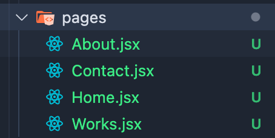
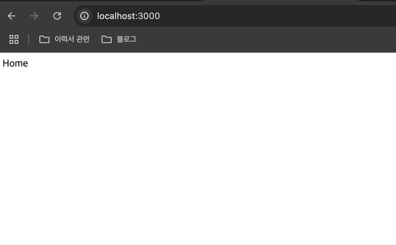
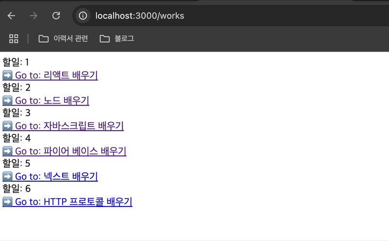

# React Router Dom

- 페이지를 구현할 수 있게 해주는 패키지다.

```bash
yarn add react-router-dom
```

- 위 명령어로 설치할 수 있다.

## 사용하기

### 사용방법 순서

1. 페이지 컴포넌트 생성
2. `Router.js` 생성 및 router 설정 코드 작성
3. `App.js`에 `import` 및 적용
4. 페이지 이동 테스트

### 페이지 컴포넌트 생성



### [중요] Router.js 생성 및 route 설정 코드 작성

- 브라우저에 우리가 URL을 입력하고 이동했을 때 우리가 원하는 페이지 컴포넌트로 이동하게끔 만드는 부분이다.
- URL 1개당 페이지 컴포넌트를 매칭해주는 것이다.
- 이 한개의 URL을 Route라고 한다.
- Route들을 설정하는 코드는 `Router.js`라는 파일을 별도로 분리해서 많이 작성하곤 한다.
- `src` 안에 `shared`라는 폴더를 생성하고, 그 안에 `Router.js` 파일을 생성해준다.

```js
import React from "react";
// 1. react-router-dom을 사용하기 위해서 아래 API들을 import 한다.
import { BrowserRouter, Route, Routes } from "react-router-dom";

// 2. Router 라는 함수를 만들고 아래와 같이 작성합니다.
//BrowserRouter를 Router로 감싸는 이유는,
//SPA의 장점인 브라우저가 깜빡이지 않고 다른 페이지로 이동할 수 있게 만들어주기 때문이다!
const Router = () => {
  return (
    <BrowserRouter>
      <Routes></Routes>
    </BrowserRouter>
  );
};

export default Router;
```

- 이렇게 작성하면, 우리가 Route를 설정할 뼈대가 완성된다.
- 이제 4개의 페이지 컴포넌트 마다 Route를 설정해보자.

```js
import React from "react";
import { BrowserRouter, Route, Routes } from "react-router-dom";
import Home from "../pages/Home";
import About from "../pages/About";
import Contact from "../pages/Contact";
import Works from "../pages/Works";

const Router = () => {
  return (
    <BrowserRouter>
      <Routes>
        {/* 
            Routes안에 이렇게 작성한다. 
            Route에는 react-router-dom에서 지원하는 props들이 있다.

            path는 우리가 흔히 말하는 사용하고싶은 "주소"를 넣어주면 된다.
            element는 해당 주소로 이동했을 때 보여주고자 하는 컴포넌트를 넣어준다.
        */}
        <Route path="/" element={<Home />} />
        <Route path="about" element={<About />} />
        <Route path="contact" element={<Contact />} />
        <Route path="works" element={<Works />} />
      </Routes>
    </BrowserRouter>
  );
};

export default Router;
```

### App.js에 `Router.js` `import` 해주기

- 이렇게 생성한 `Router` 컴포넌트를 아래 코드와 같이 `App.js`에 넣어준다.

```jsx
import React from "react";
import Router from "./shared/Router";

function App() {
  return <Router />;
}

export default App;
```

- `Router.js`를 `App.js`에 넣어주는 이유는 우리가 만든 프로젝트에서 가장 최상위에 존재하는 컴포넌트이기 때문이다.
- 즉, 우리가 어떤 컴포넌트를 화면에 띄우던, 항상 `App.js`를 거쳐야만 한다.
- 그래서 path 별로 분기되는 `Router.js`를 `App.js`에 위치시키고 우리의 서비스를 이용하는 모든 사용자가 항상 `App.js -> Router.js` 경로를 거치도록 코드를 구현해주는 것이다.

### 페이지 이동 테스트



## react-router-dom Hooks

- `react-router-dom`에서도 유용하게 사용할 수 있는 `hook`을 제공한다.
- 종류가 많지만 쓰임새가 많고 기본적인 것들을 알아보자.

### useNavigate

- 다른 페이지로 보내고자 할 때 사용할 수 있다.
- 버튼의 클릭 이벤트 핸들러에 아래와 같이 코드를 작성하면 버튼을 클릭했을 때 보내고자 하는 path로 페이지를 이동시킬 수 있다.

```jsx
// src/pages/home.js
import { useNavigate } from "react-router-dom";

const Home = () => {
  const navigate = useNavigate();

  return (
    <button
      onClick={() => {
        navigate("/works");
      }}
    >
      works로 이동
    </button>
  );
};

export default Home;
```

### useLocation

- `react-router-dom`을 사용하면, 우리가 현재 위치하고 있는 페이지의 여러가지 정보를 추가적으로 얻을 수 있다.
- 이 정보들을 이용해서 페이지 안에서 조거부 렌더링에 사용하는 등, 여러가지 용도로 활용할 수 있다.

```jsx
// src/pages/works.js
import { useLocation } from "react-router-dom";

const Works = () => {
  const location = useLocation();
  console.log("location :>> ", location);
  return (
    <div>
      <div>{`현재 페이지 : ${location.pathname.slice(1)}`}</div>
    </div>
  );
};

export default Works;
```

### Link

- `Link`는 훅은 아니지만 꼭 알아야 할 API다.
- `Link`는 html 태그 중에 `a` 태그의 기능을 대체하는 API다.
- 만약 JSX에서 `a`태그를 사용해야 한다면, 반드시 `Link`를 사용해서 구현해야 한다.
- 왜냐하면 `a` 태그를 사용하면 페이지를 이동하면서 브라우저가 새로고침되기 때문이다.
- 브라우저가 새로고침 되면 모든 컴포넌트가 다시 렌더링되어야 하고, 또한 우리가 리덕스나 `useState`를 통해 메모리상에 구축해놓은 모든 상태값이 초기화된다.
- 이것은 성능에 악영향을 줄 수 있고, 불필요한 움직임이다.
- 페이지를 이동시키고자 할 때 `useNavigate` 또는 `Link` 중에 더 적합한 방식으로 활용하면 된다.

```jsx
import { Link, useLocation } from "react-router-dom";

const Works = () => {
  const location = useLocation();
  console.log("location :>> ", location);
  return (
    <div>
      <div>{`현재 페이지 : ${location.pathname.slice(1)}`}</div>
      <Link to="/contact">contact 페이지로 이동하기</Link>
    </div>
  );
};

export default Works;
```

## children 용도

- 공식 문서에는 `props.children`에 대해 아래와 같이 설명한다.

> 어떤, 컴포넌트들은 어떤 자식 엘리먼트가 들어올지 미리 예상할 수 없는 경우가 있습니다. 범용적인 '박스'역할을 하는 Sidebar 혹은 Dialog와 같은 컴포넌트에서 특히 자주 볼 수 있습니다.

- 여기서 말하는 범용적인 박스역할을 하는 컴포넌트란 크게 봤을 때 `Layout` 역할을 하는 컴포넌트라고 생각해볼 수 있다.
- children props를 찾아보면 composition이라는 말을 많이 보게 될 텐데, composition은 합성이라는 의미가 있다고 한다.
- children props를 가지고 페이지 레이아웃을 만들며 개별적으로 존재하는 `Header`, `Footer`, `Page`를 합성하여 개발자가 의도하는 UI를 만들어주는 `Layout` 컴포넌트를 만들어 보자.

- src/shared/Layout.js

  ```jsx
  // src/shared/Layout.js
  import React from "react";

  const HeaderStyles = {
    width: "100%",
    background: "black",
    height: "50px",
    display: "flex",
    alignItems: "center",
    paddingLeft: "20px",
    color: "white",
    fontWeight: "600",
  };
  const FooterStyles = {
    width: "100%",
    height: "50px",
    display: "flex",
    background: "black",
    color: "white",
    alignItems: "center",
    justifyContent: "center",
    fontSize: "12px",
  };

  const layoutStyles = {
    display: "flex",
    flexDirection: "column",
    justifyContent: "center",
    alignItems: "center",
    minHeight: "90vh",
  };

  function Header() {
    return (
      <div style={{ ...HeaderStyles }}>
        <span>Sparta Coding Club - Let's learn React</span>
      </div>
    );
  }

  function Footer() {
    return (
      <div style={{ ...FooterStyles }}>
        <span>copyright @SCC</span>
      </div>
    );
  }

  function Layout({ children }) {
    return (
      <div>
        <Header />
        <div style={{ ...layoutStyles }}>{children}</div>
        <Footer />
      </div>
    );
  }

  export default Layout;
  ```

- src/shared/Router.js

  ```jsx
  import React from "react";
  import { BrowserRouter, Route, Routes } from "react-router-dom";
  import Home from "../pages/Home";
  import About from "../pages/About";
  import Contact from "../pages/Contact";
  import Works from "../pages/Works";
  import Layout from "./Layout";

  const Router = () => {
    return (
      <BrowserRouter>
        <Layout>
          <Routes>
            <Route path="/" element={<Home />} />
            <Route path="about" element={<About />} />
            <Route path="contact" element={<Contact />} />
            <Route path="works" element={<Works />} />
          </Routes>
        </Layout>
      </BrowserRouter>
    );
  };

  export default Router;
  ```

## 상세 페이지 구현하기

### Dynamic Route란?

- 동적 라우팅이라고도 말하는데 path에 유동적인 값을 넣어서 특정 페이지로 이동하게끔 구현하는 방법을 말한다.
- 예를 들어 `works` 페이지에 여러개의 `work`가 보이고 우리가 `work`마다 독립적인 페이지를 가지도록 구현하려면 어떻게 해야 할까?
- `react-router-dom`에서 지원하는 Dynamic Routes 기능을 이용해서 간결하게 동적으로 변하는 페이지를 처리할 수 있다.

### Dynamic Route 설정하기

```jsx
import React from "react";
import { BrowserRouter, Route, Routes } from "react-router-dom";
import Home from "../pages/Home";
import About from "../pages/About";
import Contact from "../pages/Contact";
import Works from "../pages/Works";

const Router = () => {
  return (
    <BrowserRouter>
      <Routes>
        <Route path="/" element={<Home />} />
        <Route path="about" element={<About />} />
        <Route path="contact" element={<Contact />} />
        <Route path="works" element={<Works />} />
        {/* 아래 코드를 추가해주세요. 👇 */}
        <Route path="works/:id" element={<Works />} />
      </Routes>
    </BrowserRouter>
  );
};

export default Router;
```

- 이전과는 다르게 `path`에 `works/:id`가 들어간다.
- `:id`라는 것이 바로 동적인 값을 받겠다라는 의미다.
- 그래서 works/1로 이동해도 `<Works/>`로 이동하고, works/2, works/3, ... works/100 모두 `<Works/>`로 이동하게 해준다.
- 그리고 `:id`는 `useParams` 훅에서 조회할 수 있는 값이다.

### 페이지 이동 테스트


## Dynamic Routes와 useParam

### query parameter 조회하기

- `useParam`을 이용하면 같은 컴포넌트를 렌더링하더라도 각각의 고유한 `id` 값을 조회할 수 있다.

```jsx
// src/pages/Works.js

import React from "react";
import { Link } from "react-router-dom";

const data = [
  { id: 1, todo: "리액트 배우기" },
  { id: 2, todo: "노드 배우기" },
  { id: 3, todo: "자바스크립트 배우기" },
  { id: 4, todo: "파이어 베이스 배우기" },
  { id: 5, todo: "넥스트 배우기" },
  { id: 6, todo: "HTTP 프로토콜 배우기" },
];

function Works() {
  return (
    <div>
      {data.map((work) => {
        return (
          <div key={work.id}>
            <div>할일: {work.id}</div>
            <Link to={`/works/${work.id}`}>
              <span style={{ cursor: "pointer" }}>➡️ Go to: {work.todo}</span>
            </Link>
          </div>
        );
      })}
    </div>
  );
}

export default Works;
```

```jsx
// src/pages/Work.js

import React from "react";
import { useParams } from "react-router-dom";

const data = [
  { id: 1, todo: "리액트 배우기" },
  { id: 2, todo: "노드 배우기" },
  { id: 3, todo: "자바스크립트 배우기" },
  { id: 4, todo: "파이어 베이스 배우기" },
  { id: 5, todo: "넥스트 배우기" },
  { id: 6, todo: "HTTP 프로토콜 배우기" },
];

function Work() {
  const param = useParams();

  const work = data.find((work) => work.id === parseInt(param.id));

  return <div>{work.todo}</div>;
}

export default Work;
```

- 브라우저로 확인해보자.



## 정리

- `react-router-dom`을 이용하면, SPA 기반인 리액트 프로젝트 안에서 여러개의 페이지를 구현할 수 있다.
- `Router.js`에 Route 설정에 관련된 코드를 작성하고, 최상위 컴포넌트인 `App.js`에서 `import`해서 사용한다.
- `react-router-dom`은 여러 훅을 제공한다.
- `react-router-dom`을 통해 Dynamic Route를 설정할 수 있다.
- Dynamic Route를 설정할 때는 `:id`로 설정하고, `id` 값은 `useParams`를 이용해서 각 컴포넌트에서 조회할 수 있다.
