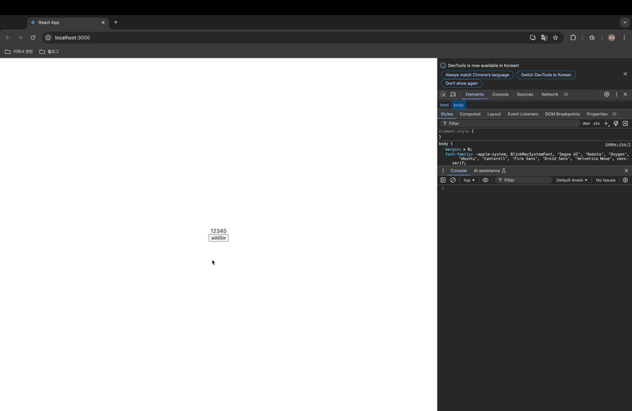

## 리액트에서 순수 함수를 사용해야 하는 이유

### 왜 리액트에서는 원시데이터가 아닌 데이터의 불변성을 지켜주는 것을 중요시할까?

- 리액트에서는 화면을 리렌더링 할지 말지 결정할 때 `state`의 변화를 확인한다.
- `state`가 변했으면 리렌더링을 하고 `state`가 변하지 않았으면 리렌더링을 하지 않는다.
- `state`가 변했는지 변하지 않았는지 확인하는 방법이 `state`의 변화 전, 후의 `메모리 주소`를 비교한다.
- 만약 리액트에서 원시데이터가 아닌 데이터를 수정할 때 불변성을 지켜주지 않고 직접 수정을 가하면 값은 바뀌지만 메모리주소는 변함이 없게 된다.
- 따라서 개발자가 값은 바꿨지만 리액트는 `state`가 변했다고 인지하지 못해, 리렌더링이 일어나지 않게 된다.

### 순수 함수

- 하나 이상의 인자를 받고, 인자를 변경하지 않고, 참조하여 새로운 값을 반환하는 함수.
- 즉, 같은 진자가 전달되면 항상 동일한 결과를 반환하는 함수이다.

**순수 함수**

```js
const addSixPure = (arr) => {
  newArr = [...arr, 6];
  return newArr;
};
```

**순수 함수가 아닌 것**

```js
const num_arr = [1, 2, 3, 4, 5];

const addSixPure = (arr) => {
  arr.push(6);
  return arr;
};
```

### 리액트에서 왜 순수 함수?

1. 컴포넌트의 많은 루틴을 순수 함수로서 작성하기를 요구한다.
   - 컴포넌트에서 `state`와 `props`가 같으면 항상 같은 값을 반환해야 한다.
   - 다른 Side effects를 발생시키지 않아야 한다(HTTP 요청, 데이터 저장, 쿠키 조작 등).
2. 컴포넌트의 상탯값은 불변 객체(Immutable Object)로 관리해야 한다.
   - 수정할 때에는 기존 값을 변경하는 것이 아니라, 같은 이름의 새로운 객체를 생성한다.
3. 이를 통해, UI 개발의 복잡도를 낮추고, 버그 발생 확률도 줄인다.
   - 같은 입력에 대해 항상 같은 출력을 보장하니, 테스트 하기도 훨씬 수월하다.

### 예시 코드

- 순수 함수를 사용하지 않은 경우

  ```jsx
  function App() {
    const [arr, setArr] = useState([1, 2, 3, 4, 5]);
    const addSixPure = () => {
      arr.push(6);
      setArr(arr);
    };

    return (
      <div
        style={{
          height: "100vh",
          display: " flex",
          flexDirection: "column",
          justifyContent: "center",
          alignItems: "center",
        }}
      >
        {arr}
        <button onClick={addSixPure}>addSix</button>
      </div>
    );
  }

  export default App;
  ```

  

  - 렌더링되지 않는 것을 확인할 수 있다.

- 순수 함수를 사용한 경우

  ```jsx
  function App() {
    const [arr, setArr] = useState([1, 2, 3, 4, 5]);
    const addSixPure = () => {
      setArr([...arr, 6]);
    };

    return (
      <div
        style={{
          height: "100vh",
          display: " flex",
          flexDirection: "column",
          justifyContent: "center",
          alignItems: "center",
        }}
      >
        {arr}
        <button onClick={addSixPure}>addSix</button>
      </div>
    );
  }

  export default App;
  ```

  

  - 정상적으로 렌더링 되는 것을 확인할 수 있다.

## useState를 업데이트하는 두 가지 방법

1. 일반 사용법

   ```jsx
   import { useState } from "react";

   const App = () => {
     const [number, setNumber] = useState(0);
     return (
       <div>
         {/* 버튼을 누르면 1씩 플러스된다. */}
         <div>{number}</div>
         <button
           onClick={() => {
             setNumber(number + 1); // 첫번째 줄
             setNumber(number + 1); // 두번쨰 줄
             setNumber(number + 1); // 세번째 줄
           }}
         >
           버튼
         </button>
       </div>
     );
   };

   export default App;
   ```

   - 일반 업데이트 방식으로 `onClick` 안에 `setNumber(number + 1)`을 3번 호출하면 `number`가 `1`씩 증가한다.

2. 함수형 업데이트 방식

   ```jsx
   import { useState } from "react";

   const App = () => {
     const [number, setNumber] = useState(0);
     return (
       <div>
         {/_ 버튼을 누르면 3씩 플러스 된다. _/}
         <div>{number}</div>
         <button
           onClick={() => {
             setNumber((previousState) => previousState + 1);
             setNumber((previousState) => previousState + 1);
             setNumber((previousState) => previousState + 1);
           }}
         >
           버튼
         </button>
       </div>
     );
   };

   export default App;
   ```

   - 함수형 업데이트 방식을 사용하면 `number`가 `3`씩 증가한다.

### 다르게 동작하는 이유

- 일반 업데이트 방식은 버튼을 클릭했을 때 `setNumber`가 각각 실행되는 것이 아니라 배치(batch)로 처리한다.
- 즉, `onClick`을 했을 때 `setNumber` 명령을 세 번 내리지만 리액트는 명령을 하나로 모아 최종적으로 한 번만 실행시킨다.
- 반면에 함수형 업데이트 방식은 `setNumber` 명령을 세 번 내리면 명령을 모아 순차적으로 각각 한 번씩 실행시킨다.
- 리액트팀이 `useState`가 위 방식으로 동작하도록 만든 이유는 불필요한 리렌더링을 방지(렌더링 최적화)하기 위해 한꺼번에 `state`를 업데이트 한다.

## useEffect clean up

- 클린 업이란?
  - 컴포넌트가 사라졌을 때 무언가를 실행시키는 것.
  - `useEffect` 안에 `return`을 해주고 이 부분에 실행되길 원하는 함수를 넣어준다.

```jsx
import React, { useEffect } from "react";

const App = () => {
  useEffect(() => {
    // 화면에 컴포넌트가 나타났을(mount) 때 실행하고자 하는 함수를 넣어주세요.

    return () => {
      // 화면에서 컴포넌트가 사라졌을(unmount) 때 실행하고자 하는 함수를 넣어주세요.
    };
  }, []);

  return <div>hello react!</div>;
};

export default App;
```

## 최적화를 위해 해야할 것들

- `map` 사용 시 `key` 넣어주기
  - 만약 `key`가 없다면 리액트에서는 가상돔을 비교하는 과정에서 배열을 순차적으로 비교하면서 변화를 감지하려 하지만 있으면 `key`를 이용해서 어떤 변화가 일어났는지 더 빠르게 알아낼 수 있다.
