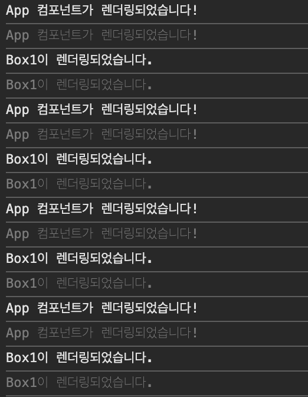

## 리액트에서 순수 함수를 사용해야 하는 이유

### 왜 리액트에서는 원시데이터가 아닌 데이터의 불변성을 지켜주는 것을 중요시할까?

- 리액트에서는 화면을 리렌더링 할지 말지 결정할 때 `state`의 변화를 확인한다.
- `state`가 변했으면 리렌더링을 하고 `state`가 변하지 않았으면 리렌더링을 하지 않는다.
- `state`가 변했는지 변하지 않았는지 확인하는 방법이 `state`의 변화 전, 후의 `메모리 주소`를 비교한다.
- 만약 리액트에서 원시데이터가 아닌 데이터를 수정할 때 불변성을 지켜주지 않고 직접 수정을 가하면 값은 바뀌지만 메모리주소는 변함이 없게 된다.
- 따라서 개발자가 값은 바꿨지만 리액트는 `state`가 변했다고 인지하지 못해, 리렌더링이 일어나지 않게 된다.

### 순수 함수

- 하나 이상의 인자를 받고, 인자를 변경하지 않고, 참조하여 새로운 값을 반환하는 함수.
- 즉, 같은 진자가 전달되면 항상 동일한 결과를 반환하는 함수이다.

**순수 함수**

```js
const addSixPure = (arr) => {
  newArr = [...arr, 6];
  return newArr;
};
```

**순수 함수가 아닌 것**

```js
const num_arr = [1, 2, 3, 4, 5];

const addSixPure = (arr) => {
  arr.push(6);
  return arr;
};
```

### 리액트에서 왜 순수 함수?

1. 컴포넌트의 많은 루틴을 순수 함수로서 작성하기를 요구한다.
   - 컴포넌트에서 `state`와 `props`가 같으면 항상 같은 값을 반환해야 한다.
   - 다른 Side effects를 발생시키지 않아야 한다(HTTP 요청, 데이터 저장, 쿠키 조작 등).
2. 컴포넌트의 상탯값은 불변 객체(Immutable Object)로 관리해야 한다.
   - 수정할 때에는 기존 값을 변경하는 것이 아니라, 같은 이름의 새로운 객체를 생성한다.
3. 이를 통해, UI 개발의 복잡도를 낮추고, 버그 발생 확률도 줄인다.
   - 같은 입력에 대해 항상 같은 출력을 보장하니, 테스트 하기도 훨씬 수월하다.

### 예시 코드

- 순수 함수를 사용하지 않은 경우

  ```jsx
  function App() {
    const [arr, setArr] = useState([1, 2, 3, 4, 5]);
    const addSixPure = () => {
      arr.push(6);
      setArr(arr);
    };

    return (
      <div
        style={{
          height: "100vh",
          display: " flex",
          flexDirection: "column",
          justifyContent: "center",
          alignItems: "center",
        }}
      >
        {arr}
        <button onClick={addSixPure}>addSix</button>
      </div>
    );
  }

  export default App;
  ```

  

  - 렌더링되지 않는 것을 확인할 수 있다.

- 순수 함수를 사용한 경우

  ```jsx
  function App() {
    const [arr, setArr] = useState([1, 2, 3, 4, 5]);
    const addSixPure = () => {
      setArr([...arr, 6]);
    };

    return (
      <div
        style={{
          height: "100vh",
          display: " flex",
          flexDirection: "column",
          justifyContent: "center",
          alignItems: "center",
        }}
      >
        {arr}
        <button onClick={addSixPure}>addSix</button>
      </div>
    );
  }

  export default App;
  ```

  

  - 정상적으로 렌더링 되는 것을 확인할 수 있다.

## useState를 업데이트하는 두 가지 방법

1. 일반 사용법

   ```jsx
   import { useState } from "react";

   const App = () => {
     const [number, setNumber] = useState(0);
     return (
       <div>
         {/* 버튼을 누르면 1씩 플러스된다. */}
         <div>{number}</div>
         <button
           onClick={() => {
             setNumber(number + 1); // 첫번째 줄
             setNumber(number + 1); // 두번쨰 줄
             setNumber(number + 1); // 세번째 줄
           }}
         >
           버튼
         </button>
       </div>
     );
   };

   export default App;
   ```

   - 일반 업데이트 방식으로 `onClick` 안에 `setNumber(number + 1)`을 3번 호출하면 `number`가 `1`씩 증가한다.

2. 함수형 업데이트 방식

   ```jsx
   import { useState } from "react";

   const App = () => {
     const [number, setNumber] = useState(0);
     return (
       <div>
         {/_ 버튼을 누르면 3씩 플러스 된다. _/}
         <div>{number}</div>
         <button
           onClick={() => {
             setNumber((previousState) => previousState + 1);
             setNumber((previousState) => previousState + 1);
             setNumber((previousState) => previousState + 1);
           }}
         >
           버튼
         </button>
       </div>
     );
   };

   export default App;
   ```

   - 함수형 업데이트 방식을 사용하면 `number`가 `3`씩 증가한다.

### 다르게 동작하는 이유

- 일반 업데이트 방식은 버튼을 클릭했을 때 `setNumber`가 각각 실행되는 것이 아니라 배치(batch)로 처리한다.
- 즉, `onClick`을 했을 때 `setNumber` 명령을 세 번 내리지만 리액트는 명령을 하나로 모아 최종적으로 한 번만 실행시킨다.
- 반면에 함수형 업데이트 방식은 `setNumber` 명령을 세 번 내리면 명령을 모아 순차적으로 각각 한 번씩 실행시킨다.
- 리액트팀이 `useState`가 위 방식으로 동작하도록 만든 이유는 불필요한 리렌더링을 방지(렌더링 최적화)하기 위해 한꺼번에 `state`를 업데이트 한다.

## useEffect clean up

- 클린 업이란?
  - 컴포넌트가 사라졌을 때 무언가를 실행시키는 것.
  - `useEffect` 안에 `return`을 해주고 이 부분에 실행되길 원하는 함수를 넣어준다.

```jsx
import React, { useEffect } from "react";

const App = () => {
  useEffect(() => {
    // 화면에 컴포넌트가 나타났을(mount) 때 실행하고자 하는 함수를 넣어주세요.

    return () => {
      // 화면에서 컴포넌트가 사라졌을(unmount) 때 실행하고자 하는 함수를 넣어주세요.
    };
  }, []);

  return <div>hello react!</div>;
};

export default App;
```

## useRef

```jsx
import "./App.css";
import { useRef } from "react";

function App() {
  const ref = useRef("초기값");
  console.log("ref", ref);

  return (
    <div>
      <p>useRef에 대한 이야기에요.</p>
    </div>
  );
}

export default App;
```

- 콘솔을 확인해보면, `ref`에는 값이 아래와 같이 담겨있다.


- 값을 변경할 수도 있다.

```jsx
import "./App.css";
import { useRef } from "react";

function App() {
  const ref = useRef("초기값");
  console.log("ref 1", ref);

  ref.current = "바꾼 값";
  console.log("ref 1", ref);

  return (
    <div>
      <p>useRef에 대한 이야기에요.</p>
    </div>
  );
}

export default App;
```

- 콘솔에 출력된 값은 아래와 같다.


- **이렇게 설정된 `ref` 값은 컴포넌트가 계속 렌더링 되어도 `unmount` 전까지 값을 유지한다.**
- 이러한 특징 때문에 `useRef`는 다음 두 가지 용도로 사용된다.
  1. 저장 공간
     - `state`와 비슷한 역할을 한다. 다만 `state`는 변화가 일어나면 다시 렌더링이 일어나지만 `ref`에 저장한 값은 렌더링을 일으키지 않는다.
     - 즉, `ref`의 값 변화가 일어나도 렌더링으로 인해 내부 변수들이 초기화 되는 것을 막을 수 있다.
     - 정리하면 `state`는 리렌더링이 꼭 필요한 값, `ref`는 리렌더링을 발생시키지 않는 값을 저장할 때 사용한다.
  2. DOM
  - DOM 요소에 접근하기 위해서 사용된다.

## useContext

- `props drilling`의 문제점을 해결하고자 나온 `hook`으로 쉽게 전역 데이터 관리를 할 수 있게 해준다.
- `createContext`: context 생성
- `Consumer`: context 변화 감지
- `Provider`: context 전달(to 하위 컴포넌트)
- `useContext`를 사용할 때, `Provider`에서 제공한 `value`가 달라진다면 `useContext`를 사용하고 있는 모든 컴포넌트가 리렌더링 된다.
- 따라서 `value` 부분을 항상 신경써줘야 한다.

## React Hooks - 최적화(React.memo, uesCallback, useMemo)

### 시작하기에 앞서

1. 리렌더링의 발생 조건
   1. 컴포넌트에서 `state`가 바뀌었을 때
   2. 컴포넌트가 내려받은 `props`가 변경되었을 때
   3. 부모 컴포넌트가 리렌더링 된 경우 자식 컴포넌트는 모두
2. 최적화
   - 리액트에서 불필요한 리렌더링을 발생하지 않도록 최적화 하는 대표적인 방법 3가지
     1. `memo(Rect.memo)`: 컴포넌트를 캐싱
     2. `useCallback`: 함수를 캐싱
     3. `useMemo`: 값을 캐싱

### memo(Rect.memo)

- 부모 컴포넌트가 리렌더링 되면서 자식 컴포넌트는 모두 리렌더링 된다는 것을 그림으로 보면
  
  - 1번 컴포넌트가 리렌더링되면 2~7번이 모두 리렌더링 된다.
  - 4번 컴포넌트가 리렌더링되면 6, 7번이 모두 리렌더링 된다.
- 자식 컴포넌트가 바뀐게 없는데 불필요하게 리렌더링되는 걸 방지하는 도구가 `React.memo`다.

#### 예제 코드

- App.jsx

  ```jsx
  import React, { useState } from "react";
  import Box1 from "./components/Box1";
  import Box2 from "./components/Box2";
  import Box3 from "./components/Box3";

  const boxesStyle = {
    display: "flex",
    marginTop: "10px",
  };

  function App() {
    console.log("App 컴포넌트가 렌더링되었습니다!");

    const [count, setCount] = useState(0);

    // 1을 증가시키는 함수
    const onPlusButtonClickHandler = () => {
      setCount(count + 1);
    };

    // 1을 감소시키는 함수
    const onMinusButtonClickHandler = () => {
      setCount(count - 1);
    };

    return (
      <>
        <h3>카운트 예제입니다!</h3>
        <p>현재 카운트 : {count}</p>
        <button onClick={onPlusButtonClickHandler}>+</button>
        <button onClick={onMinusButtonClickHandler}>-</button>
        <div style={boxesStyle}>
          <Box1 />
          <Box2 />
          <Box3 />
        </div>
      </>
    );
  }

  export default App;
  ```

- Box1.jsx

  ```jsx
  import React from "react";

  const boxStyle = {
    width: "100px",
    height: "100px",
    backgroundColor: "#91c49f",
    color: "white",

    // 가운데 정렬 3종세트
    display: "flex",
    justifyContent: "center",
    alignItems: "center",
  };

  function Box1() {
    console.log("Box1이 렌더링되었습니다.");
    return <div style={boxStyle}>Box1</div>;
  }

  export default Box1;
  ```

- Box2.jsx

  ```jsx
  import React from "react";

  const boxStyle = {
    width: "100px",
    height: "100px",
    backgroundColor: "#4e93ed",
    color: "white",

    // 가운데 정렬 3종세트
    display: "flex",
    justifyContent: "center",
    alignItems: "center",
  };

  function Box2() {
    console.log("Box2가 렌더링되었습니다.");
    return <div style={boxStyle}>Box2</div>;
  }

  export default Box2;
  ```

- Box3.jsx

  ```jsx
  import React from "react";

  const boxStyle = {
    width: "100px",
    height: "100px",
    backgroundColor: "#c491be",
    color: "white",

    // 가운데 정렬 3종세트
    display: "flex",
    justifyContent: "center",
    alignItems: "center",
  };

  function Box3() {
    console.log("Box3가 렌더링되었습니다.");
    return <div style={boxStyle}>Box3</div>;
  }

  export default Box3;
  ```

- 위와 같은 코드를 작성하고 plus 또는 minus 버튼을 누르면 모든 하위 컴포넌트가 리렌더링되는 걸 확인할 수 있다.
  
- 실제로 변한 것은 부모 컴포넌트인 `App.jsx` 뿐인데도 말이다.

#### memo를 통해 해결해보기

- `React.memo`를 이용해서 컴포넌트를 메모리에 저장해두고 필요할 때 갖다 쓰게 된다.
- 이렇게 하면 부모 컴포넌트의 `state` 변경으로 인해 `props`가 변경이 일어나지 않는 한 컴포넌트는 리렌더링 되지 않고 이를 컴포넌트 memoization이라고 한다.

```jsx
export default React.memo(Box1);
export default React.memo(Box2);
export default React.memo(Box3);
```

- 이렇게 사용하면 최초 렌더링 이외에 부모 컴포넌트의 `state`가 변경되더라도 자식 컴포넌트들은 렌더링되지 않는다.


### useCallback

- `useCallback`은 인자로 들어오는 함수 자체를 기억(메모이제이션)한다.

#### 예제 코드

- 앞서 본 예제 코드에서 `Box1`이 `count`를 초기화 해주는 코드라고 가정해보자.

- App.jsx

```jsx
...

  // count를 초기화해주는 함수
  const initCount = () => {
    setCount(0);
  };

  return (
    <>
      <h3>카운트 예제입니다!</h3>
      <p>현재 카운트 : {count}</p>
      <button onClick={onPlusButtonClickHandler}>+</button>
      <button onClick={onMinusButtonClickHandler}>-</button>
      <div style={boxesStyle}>
        <Box1 initCount={initCount} />
        <Box2 />
        <Box3 />
      </div>
    </>
  );
}

...
```

- Box1.jsx

```jsx
...

function Box1({ initCount }) {
  console.log("Box1이 렌더링되었습니다.");

  const onInitButtonClickHandler = () => {
    initCount();
  };

  return (
    <div style={boxStyle}>
      <button onClick={onInitButtonClickHandler}>초기화</button>
    </div>
  );
}

...
```

- plus, minus, 초기화 버튼을 누를 때 모두 `App` 컴포넌트와 `Box1` 컴포넌트가 리렌더링되는 걸 확인할 수 있다.



- `React.memo`를 통해서 `Box1`을 메모이제이션 했는데 왜 리렌더링이 될까?
  - 함수형 컴포넌트를 사용하기 때문이다.
  - `App.jsx`가 리렌더링 되면서
  ```jsx
  const onInitButtonClickHandler = () => {
    initCount();
  };
  ```
  - 코드가 다시 만들어지기 때문이다.
  - 자바스크립트에서는 함수도 객체의 한 종류이고 모양은 같더라도 다시 만들어지면 주솟값이 달라져 하위 컴포넌트인 `Box1`은 `props`가 변경됐다고 인식합니다.

#### useCallback 사용을 통한 함수 메모이제이션

- App.jsx

```jsx
// 변경 전
const initCount = () => {
  setCount(0);
};

// 변경 후
const initCount = useCallback(() => {
  setCount(0);
}, []);
```

- `initCount` 함수를 메모리 공간에 저장해놓고, 특정 조건이 아닌 경우엔 변경되지 않도록 해주면 `Box1`은 리렌더링되지 않는다.

### useMemo

- 동일한 값을 반환하는 함수를 계속 호출해야 하면 필요없는 렌더링을 한다고 볼 수 있다.
- 맨 처음 해당 값을 반환할 때 그 값을 특별한 곳(메모리)에 저장한다.
- 이렇게 하면 필요할 때마다 다시 함수를 호출하는 것이 아닌 이미 저장한 값을 꺼내와서 사용할 수 있다.
- 보통 이러한 기법을 캐싱을 한다라고 표현한다.

#### 사용법

```jsx
// as-is
const value = 반환할_함수();

// to-be
const value = useMemo(() => {
  return 반환할_함수();
}, [dependencyArray]);
```

- 의존성 배열의 값이 변경될 때만 `반환할_함수()`가 호출된다.
- 그 외의 경우에는 memoization 해놨던 값을 가져오기만 한다.

#### 예제 코드 - 1

- App.jsx

```jsx
import "./App.css";
import HeavyComponent from "./components/HeavyComponent";

function App() {
  const navStyleObj = {
    backgroundColor: "yellow",
    marginBottom: "30px",
  };

  const footerStyleObj = {
    backgroundColor: "green",
    marginTop: "30px",
  };

  return (
    <>
      <nav style={navStyleObj}>네비게이션 바</nav>
      <HeavyComponent />
      <footer style={footerStyleObj}>푸터 영역이에요</footer>
    </>
  );
}

export default App;
```

- HeavyComponent.jsx

```jsx
import React, { useState, useMemo } from "react";

function HeavyButton() {
  const [count, setCount] = useState(0);

  const heavyWork = () => {
    for (let i = 0; i < 1000000000; i++) {}
    return 100;
  };

  // CASE 1 : useMemo를 사용하지 않았을 때
  const value = heavyWork();

  // CASE 2 : useMemo를 사용했을 때
  // const value = useMemo(() => heavyWork(), []);

  return (
    <>
      <p>나는 {value}을 가져오는 엄청 무거운 작업을 하는 컴포넌트야!</p>
      <button
        onClick={() => {
          setCount(count + 1);
        }}
      >
        누르면 아래 count가 올라가요!
      </button>
      <br />
      {count}
    </>
  );
}

export default HeavyButton;
```

- `HeavyComponent` 안에서는 `const value = heavyWork()`를 통해 `value` 값을 세팅해주고 있다.
- `heavyWork`가 엄청나게 무거운 작업이라면 `state`가 바뀔 때마다 계속 호출되지만 `useMemo`로 감싸 주면 그럴 걱정이 없다.

#### 예제 코드 - 2

```jsx
import React, { useEffect, useState } from "react";

function ObjectComponent() {
  const [isAlive, setIsAlive] = useState(true);
  const [uselessCount, setUselessCount] = useState(0);

  const me = {
    name: "Ted Chang",
    age: 21,
    isAlive: isAlive ? "생존" : "사망",
  };

  useEffect(() => {
    console.log("생존여부가 바뀔 때만 호출해주세요!");
  }, [me]);

  return (
    <>
      <div>
        내 이름은 {me.name}이구, 나이는 {me.age}야!
      </div>
      <br />
      <div>
        <button
          onClick={() => {
            setIsAlive(!isAlive);
          }}
        >
          누르면 살았다가 죽었다가 해요
        </button>
        <br />
        생존여부 : {me.isAlive}
      </div>
      <hr />
      필요없는 숫자 영역이에요!
      <br />
      {uselessCount}
      <br />
      <button
        onClick={() => {
          setUselessCount(uselessCount + 1);
        }}
      >
        누르면 숫자가 올라가요
      </button>
    </>
  );
}

export default ObjectComponent;
```

- `useEffect`를 이용해서 `me`의 정보가 바뀌었을 때만 발동되게끔 의존성 배열을 넣어놨지만 엉뚱하게 `count`를 증가하는 `button`을 눌러보면 계속 로그가 찍힌다.
- 왜 이런 현상이 발생할까?
  - 불변성과 관련이 깊은데 버튼이 선택돼서 `uselessCount state`가 바뀌면
  - 리렌더링이 되고 컴포넌트 함수가 새로 호출된다.
  - `me` 객체도 다시 할당한다(메모리 주소값을 할당받는다).
  - `useEffect`의 의존성 배열에 의해 `me` 객체가 바뀌었는지 확인해봐야 하는데
  - 모양은 같지만 주소가 다르므로 `me`가 바뀌었다고 인식하여 `useEffect` 내부 로직이 호출된다.

```jsx
const me = useMemo(() => {
  return {
    name: "Ted Chang",
    age: 21,
    isAlive: isAlive ? "생존" : "사망",
  };
}, [isAlive]);
```

- 이런 상황을 해결하기 위해 `useMemo()`만 이렇게 써주면, `uselessCount`가 아무리 증가돼도 영향이 없게 된다.
- `useMemo`를 남발하게 되면 별도의 메모리 확보를 너무 많이 하게 되기 때문에 오히려 성능이 악화될 수 있으므로 필요할 때만 사용해야 한다.

## 최적화를 위해 해야할 것들

- `map` 사용 시 `key` 넣어주기
  - 만약 `key`가 없다면 리액트에서는 가상돔을 비교하는 과정에서 배열을 순차적으로 비교하면서 변화를 감지하려 하지만 있으면 `key`를 이용해서 어떤 변화가 일어났는지 더 빠르게 알아낼 수 있다.
