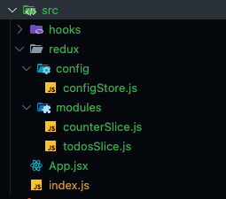
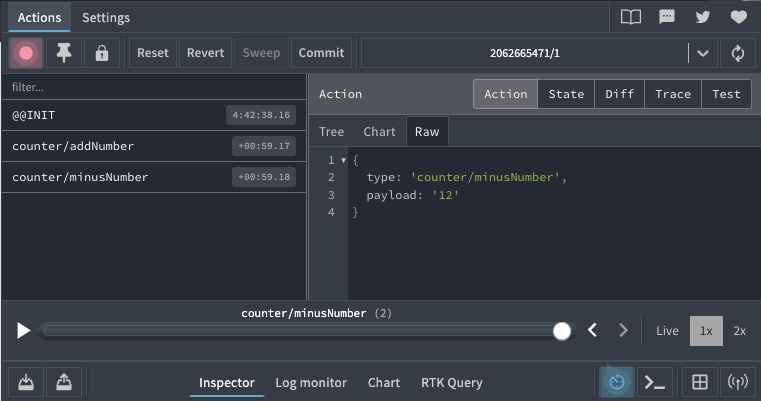

# Redux Toolkit

## 리덕스툴킷이란?

- 리덕스를 사용하기 위해 작성했던 Ducks 패턴의 요소들이 전체적인 코드의 양을 늘린다는 개발자들의 불만이 발생하기 시작했고, 리덕스 팀에서는 이를 수용하여 코드는 더 적게, 그리고 리덕스를 더 편하게 쓰기 위한 기능들을 흡수해서 만든 것이 리덕스 툴킷이다. 줄여서 RTK라고도 한다.
- 리덕스툴킷은 새로운 것이 아니다.
- 리덕스의 전체 코드의 양을 줄이기 위해 새로운 API가 추가되었고 일일히 손으로 만들어 줘야 했던 Ducks 패턴의 요소들이 어느정도 자동화 되었다.
- 컴포넌트에서 `useSelector`를 통해서 사용하는 것은 모두 똑같다.
- 바뀐 부분은 모듈 파일뿐이다.
- 이후 일반 리덕스와 툴킷의 요소를 비교해서 어떤 식으로 바뀌었는지 살펴보자.

## 일반 리덕스와 코드 비교

### 툴킷 설치하기

```bash
yarn add react-redux @reduxjs/toolkit
```

### count 프로그램 코드 비교

- 아래 코드는 일반 리덕스의 counter 프로그램 모듈이다.
- Action Value, Action Creator를 별도로 생성해줘야 했다.
- 그리고 리듀서에서 값을 어떻게 변화시킬지 만들어줬어야 했다.

```js
// 일반 리덕스 예시 코드

// Action Value
const ADD_NUMBER = "ADD_NUMBER";
const MINUS_NUMBER = "MINUS_NUMBER";

// Action Creator
export const addNumber = (payload) => {
  return {
    type: ADD_NUMBER,
    payload,
  };
};

export const minusNumber = (payload) => {
  return {
    type: MINUS_NUMBER,
    payload,
  };
};

// Initial State
const initialState = {
  number: 0,
};

// Reducer
const counter = (state = initialState, action) => {
  switch (action.type) {
    case ADD_NUMBER:
      return {
        number: state.number + action.payload,
      };
    case MINUS_NUMBER:
      return {
        number: state.number - action.payload,
      };
    default:
      return state;
  }
};

// export default reducer
export default counter;
```

- 아래 코드가 리덕스 툴킷을 사용해서 만든 counter 프로그램 모듈이다.
- 일반 리덕스를 사용했을 때보다 확실히 코드의 양이 줄었다.
- 자세 히 살펴보면 큰 차이점은 Action Value와 Action Creator를 직접 생성해주지 않고, Action Value, Action Creator, Reducer가 하나로 합쳐졌다는 점이다.
- 이제 우리는 `Slice`라는 API를 사용한다.
- `Slice`를 사용하면 저 3개를 각각 만들어줄 필요없이 한 번에 3개가 모두 만들어진다.

```js
// src/redux/modules/counterSlice.js

import { createSlice } from "@reduxjs/toolkit";

const initialState = {
  number: 0,
};

const counterSlice = createSlice({
  name: "counter",
  initialState,
  reducers: {
    addNumber: (state, action) => {
      state.number = state.number + action.payload;
    },

    minusNumber: (state, action) => {
      state.number = state.number - action.payload;
    },
  },
});

// 액션크리에이터는 컴포넌트에서 사용하기 위해 export 하고
export const { addNumber, minusNumber } = counterSlice.actions;
// reducer 는 configStore에 등록하기 위해 export default 합니다.
export default counterSlice.reducer;
```

- 슬라이스만 자세히 살펴보자.
- 슬라이스는 `createSlice`라는 API를 통해 만들 수 있다.
- 그리고 인자로 설정 정보를 객체로 받는데, 그 안에 필수로 작성해줘야 하는 값은 `name`, `initialState`, `reducers`가 있다.

```js
const counterSlice = createSlice({
  name: "", // 이 모듈의 이름
  initialState: {}, // 이 모듈의 초기상태 값
  reducers: {}, // 이 모듈의 Reducer 로직
});
```

- 신기한 것은 위의 `counterSlice` 리듀서 객체 안에서 만들어주는 함수가 리듀서의 로직이 되면서도 동시에 Action Creator가 된다는 점이다.
- 그리고 Action Value까지 함수의 이름을 따서 자동으로 만들어진다.
- 그래서 우리는 Reducer만 만들어주면 된다.

```js
const counterSlice = createSlicer({
  name: "counter",
  initialState,
  reducers: {
    addNumber: (state, action) => {
      state.number = state.number + action.payload;
    },
    minusNumber: (state, action) => {
      state.number = state.number - action.payload;
    },
  },
});
```

- 우리가 일반 리덕스에서 `export`를 통해 각각의 Action Creator를 내보내주었던 것을 아래 코드를 작성하면 똑같이 내보낼 수 있다.
- 그래서 리듀서에 로직을 추가할 때마다 함수를 추가해서 내부내주면 된다.

```js
export const { addNumber, minusNumber } = counterSlice.action;
export default counterSlice.reducer;
```

### configStore 비교

- 일반 리덕스

```js
// 일반 리덕스 combineReducers 예시 코드

import { createStore } from "redux";
import { combineReducers } from "redux";
import counter from "../modules/counter";

const rootReducer = combineReducers({
  counter,
});
const store = createStore(rootReducer);
export default store;
```

- 리덕스 툴킷의 `configStore`에서도 아래와 같이 작성하면 되며, 크게 달라지는 점은 없다.

```js
import { configureStore } from "@reduxjs/toolkit";
import counter from "../modules/counterSlice";
import todos from "../modules.todosSlice";

const store = configureStore({
  reducer: { counter: counter, todos: todos },
});

export default store;
```

- 이렇게 생성한 `store`를 `export default`해서 최상위 `index.js`의 `Provider`에 주입해주는 것은 전혀 바뀐게 없다.

```js
// index.js

import React from "react";
import ReactDOM from "react-dom/client";
import App from "./App";
import { Provider } from "react-redux";
import store from "./redux/config/configStore";

const root = ReactDOM.createRoot(document.getElementById("root"));
root.render(
  <Provider store={store}>
    <App />
  </Provider>
);
```

- `App.jsx`에서는 툴킷을 사용해서 만든 모듈을 조회할 수 있다.
- 방식은 일반 리덕스를 사용했을 때와 동일하다.

```jsx
// src/App.js

import React from "react";
import { useSelector } from "react-redux";

const App = () => {
  // Store에 있는 todos 모듈 state 조회하기
  const todos = useSelector((state) => state.todos);

  // Store에 있는 counter 모듈 state 조회하기
  const counter = useSelector((state) => state.counter);

  return <div>App</div>;
};

export default App;
```

- 아래는 위에서 작성한 파일들의 폴더 구조이다.
- `modules`안에 파일의 이름은 임의로 하면 된다.
- `counter.js`, `todos.js`로 하는 개발자도 있고, `counterSlice.js`, `todosSlice.js`로 하는 개발자도 있다.



## Redux Devtools 사용하기

- 리덕스를 사용하면, 리덕스 devtools를 사용할 수 있다.
- 다른 패키지에서는 찾아볼 수 없는 굉장히 강력한 개발툴이다.
- 현재 프로젝트의 `state` 상태라던가, 어떤 액션이 일어났을 때 그 액션이 무엇이고, 그것으로 인해 `state`가 어덯게 변경되었는지 등 리덕스를 사용하여 개발할 때 아주 편리하게 사용할 수 있다.
- 이 devtools 때문에 리덕스를 사용한다고 말해도 과언이 아니다.
  
- 액션이 `dispatch`될 때 devtools에서 `state`값이 어덯게 변했는지를 보여줍니다.
- 프로젝트가 복잡해질수록 로그를 확인하는 것이 쉽지 않은데, 이 툴을 이용해서 쉽게 디버깅을 할 수 있다.
- 툴킷이 아닌 일반 리덕스에서 devtools를 사용하고자 하면 별도의 설정이 필요하지만 툴킷은 devtools가 내장되어 있기 때문에 별도의 코드 설정 없이 바로 사용 가능하다.
